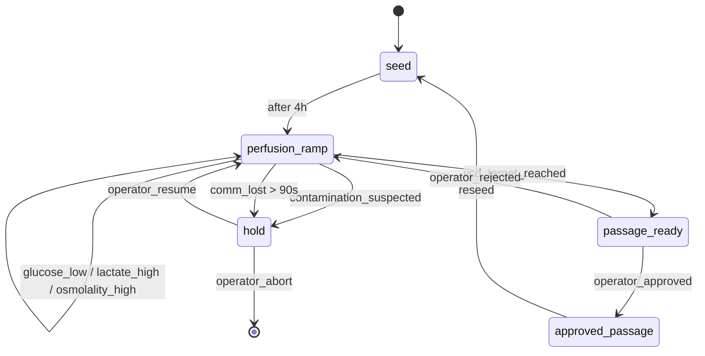
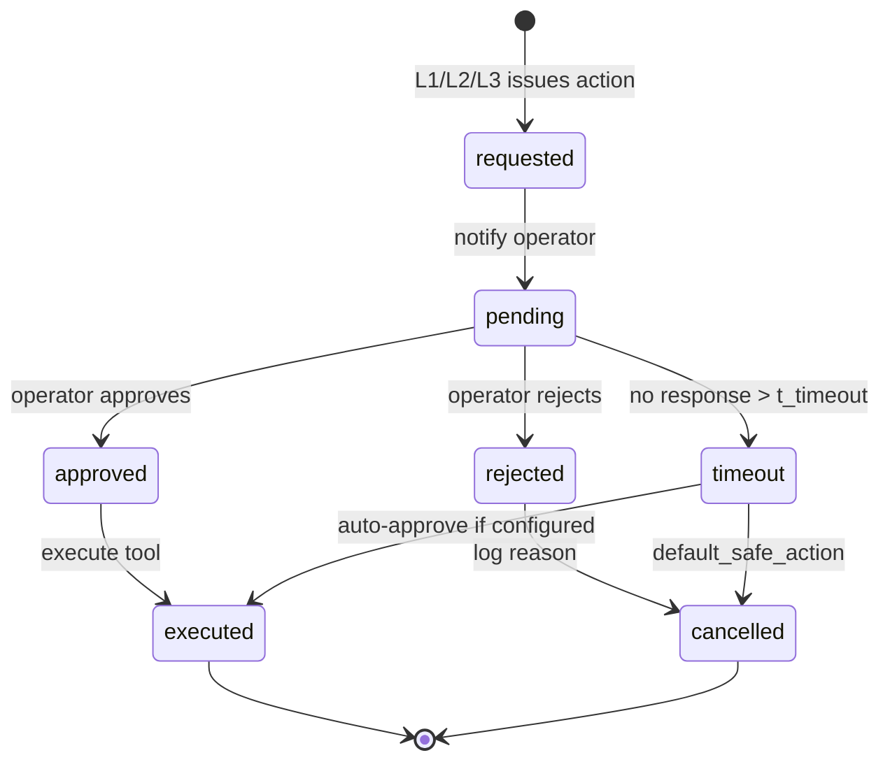
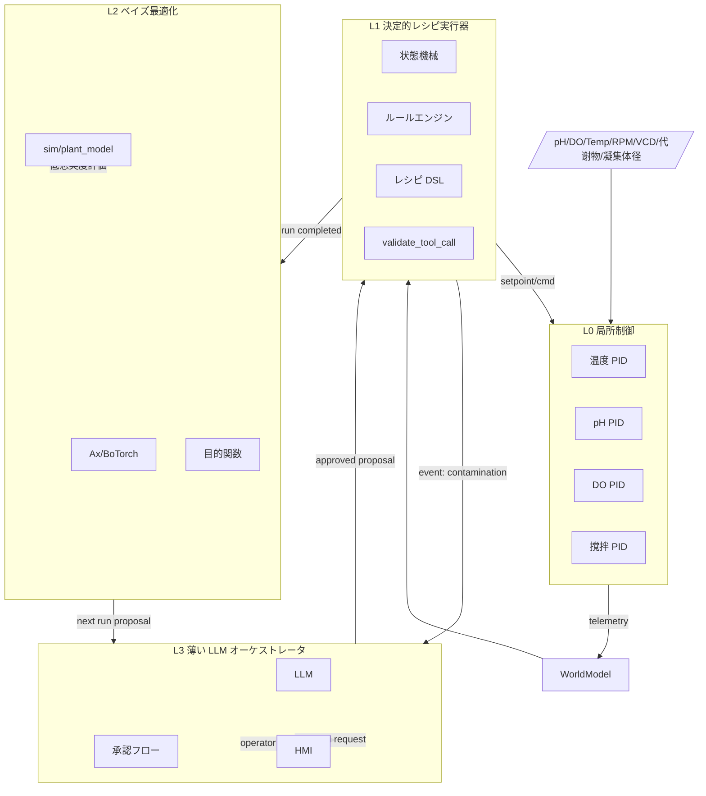

# Agent A: 制御アーキテクチャ深掘り — 設計根拠レポート

> **担当**: `agent_architecture_deep_dive`  
> **対象**: auto_cell A 層（iPSC 浮遊/凝集体バイオリアクター制御、Manstein 型灌流 0→7 vvd、目標密度 ~35×10⁶ cells/mL）  
> **前提**: ADR-0001 採用案 — **L0 局所 PID + L1 決定的レシピ/ルール + L2 ベイズ最適化 + L3 薄い LLM オーケストレータ**  
> **運転形態**: R&D / プロセス開発（一次）、Human-on-the-loop  
> **生成日**: 2026-06-16

---

## 0. 要約

本レポートは ADR-0001 (`docs/design/adr/0001-control-architecture.md`) で採用された **L0–L3 階層型制御アーキテクチャ**の各層の責務、実装方式、インターフェース、状態遷移、未決事項を深掘りする。結論としては、以下の 4 点を設計根拠として確定する。

1. **L1 は「決定的レシピ実行器＋ルールエンジン」**とし、灌流 0→7 vvd の条件起動、CPP 包絡線拘束、イベント駆動アクションを状態機械的に実行する。LLM は per-cycle に入れない。〔事実：ADR-0001; KG `loop`/`sched`/`ctrl_split`〕
2. **L2 は BoTorch/Ax を使った制約付きバッチ BO** とし、`sim/plant_model` を低忠実度評価として多忠実度化する。目的関数は run 単位のスカラ/多目的（収量・品質・コスト）とする。〔推定：Kanda et al. 2022; Manstein 2021; Ax/BoTorch 文書〕
3. **L3 はイベント駆動の薄い LLM オーケストレータ** とし、承認フロー仲介・曖昧知覚解釈・新規例外処理に限定する。定常の happy path は決定的オーケストレータで回す。〔推定：ADR-0001; requirements.md〕
4. **L0 との境界は「局所 PID が高速安全ループ、ブレインは設定点・離散アクションのみ」** とし、ブレイン停止時も局所制御＋最終検証済設定点で培養が継続する。〔事実：kg_to_auto_cell.md §7.2; KG `ctrl_split`〕

**設計境界（A 層スコープ外）**: 樹立/分化/双腕/接着 conf は本レポートでは参照のみとし、実装対象外として明記する。

---

## 1. L0 局所制御層 — 高速安全ループ

### 1.1 責務

L0 はバイオリアクター本体の **局所コントローラ（PID 等）** が担う。対象変数とブレインから見た権限は以下の通り。

| 変数 | 局所制御 | ブレイン権限 | 備考 |
|---|---|---|---|
| 温度 37 ℃ | PID | 設定点読み取りのみ（通常固定） | 〔事実：kg_to_auto_cell.md §4〕 |
| pH 7.1 | PID（CO₂/塩基カスケード） | 包絡線内設定点変更 | 〔事実：Manstein 2021, STAR Protocols Table 1〕 |
| DO 40 %→10 % | PID（ガス/撹拌カスケード） | 包絡線内設定点変更 | 〔事実：Manstein 2021〕 |
| 撹拌 50–120 rpm | モータドライバ | 包絡線内設定点変更 | 〔事実：Borys 2021; kg_to_auto_cell.md §4〕 |
| 緊急停止/無菌バリア | 安全系 | **読取のみ・強制不可** | 〔事実：kg_to_auto_cell.md §7.2〕 |

### 1.2 フェイルセーフ設計

- **ブレイン停止時**: L0 の局所 PID は最後に検証済みの設定点を保持し続ける。したがってブレイン/LLM が落ちても培養は死なない設計。〔推定：NFR-S; kg_to_auto_cell.md〕
- **通信断**: gateway は一定周期（例: 3 周期 = 90 s）ブレインから heartbeat を喪失すると、デバイス側を **hold last good setpoint** モードに遷移させる。〔推定：設計仮定〕
- **電源喪失/冷却停止**: これは装置側の安全系（UPS、冷却継続）の責務であり、auto_cell の設計境界とする。〔設計境界〕

### 1.3 L0 ↔ L1 インターフェース

```text
L1 (supervisory) --setpoint/enable--> gateway --OPC-UA/LADS method--> L0 PID controller
L0 --telemetry (pH/DO/temp/rpm/status)--> gateway --MQTT--> L1 WorldModel
```

- ブレインは **レシピで宣言された設定点** を method 呼び出しで送る。L0 は受理後、局所ループで追従。
- すべての setpoint 変更は `validate_tool_call` で包絡線・変化率を検証してから送信。〔事実：kg_to_auto_cell.md §3〕

---

## 2. L1 決定的レシピ実行器 + ルールエンジン

### 2.1 採用形態：状態機械 + ルールエンジン + 軽量 DSL

L1 は以下の 3 要素で構成する。

| 要素 | 役割 | 推奨実装 | 備考 |
|---|---|---|---|
| **レシピ DSL** | 培養フェーズ・条件起動ロジックを宣言的に記述 | YAML/JSON（社内 DSL） | 〔推定：既存レシピ実行器パターン〕 |
| **状態機械** | フェーズ遷移を明確に管理 | Python `transitions` または自前 | 〔推定：設計仮定〕 |
| **ルールエンジン** | イベント→アクションの決定的マッピング | `durable-rules` または単純 if-then テーブル | 〔推定：設計仮定〕 |

**なぜ LLM per-cycle でないか**: R&D でも run 内プロセスは既知レシピ（Manstein: 灌流 0→7 vvd・固定設定点・条件起動給餌）の決定的実行が大半であり、LLM の非決定性は再現性(NFR-Rep)・安全(NFR-S)・コスト(NFR-C)に不利。〔事実：ADR-0001; requirements.md §4 中心仮説〕

### 2.2 レシピ DSL 案

```yaml
# A-layer recipe (Manstein perfusion) — example
run:
  name: iPSC_suspension_perfusion_v1
  seeding_density: 5.0e5   # cells/mL [推定]
  phase_sequence:
    - id: seed
      duration: 4h
      setpoints: {temp: 37, ph: 7.1, do: 40, agitation: 80}
    - id: perfusion_ramp
      duration: 7d
      setpoints: {temp: 37, ph: 7.1, do: "40->10", agitation: "80->60"}
      perfusion_rate_vvd:
        mode: conditional
        initial: 0
        max: 7
        triggers:
          - condition: glucose < 1.8 mM
            action: increase_perfusion +0.5 vvd
          - condition: lactate > 35 mM
            action: increase_perfusion +0.5 vvd
          - condition: osmolality > 450 mOsm/kg
            action: increase_perfusion +0.5 vvd
      transitions:
        - event: vcd_target_reached
          target: passage_ready
    - id: passage_ready
      actions: [request_passage_approval]
```

上記数値は `kg_to_auto_cell.md` §4 に基づく。〔事実：Manstein 2021 Table 1/Table 3; kg_to_auto_cell.md §4〕

### 2.3 条件起動ロジック：灌流 0→7 vvd

Manstein 2021 の灌流プロセスでは、**glucose/lactate/osmolality** をトリガに灌流率を 0 から 7 vvd まで段階的に上げる。〔事実：Manstein 2021; kg_to_auto_cell.md §4〕

| トリガ | 閾値 | 灌流アクション | 根拠 |
|---|---|---|---|
| glucose 低下 | < 1.8 mM（推定） | +0.5 vvd | 〔推定：KGlc=1.5 mM の余裕〕 |
| lactate 上昇 | > 35 mM（推定） | +0.5 vvd | 〔推定：KLac=50 mM の余裕〕 |
| osmolality 上昇 | > 450 mOsm/kg（推定） | +0.5 vvd | 〔推定：KOsm=500 mOsm/kg の余裕〕 |
| VCD 目標到達 | ~35×10⁶ cells/mL | 継代へ遷移 | 〔事実：Manstein 2021〕 |

> **重要**: 上記閾値（1.8/35/450）は「設計仮定（推定）」であり、実機適応時に再校正が必要。KGlc/KLac/KOsm=1.5/50/500 は **Monod 阻害定数**であり、直接の警報閾値ではない。〔推定：Monod 定数と工程閾値の差〕

### 2.4 副作用ツールの起動条件と優先順位

`CellCulturePlugin.tool_schemas` に対応する主要ツールは以下。〔事実：kg_to_auto_cell.md §3〕

| ツール | 主体 | 起動条件 | 優先度 | 承認要否 |
|---|---|---|---|---|
| `set_perfusion_rate` | L1 | glucose/lactate/osmolality トリガ | 高 | 包絡線内は自律 |
| `set_agitation_rpm` | L1 | 凝集体径逸脱/シアリスク | 高 | 包絡線内は自律 |
| `set_gas_setpoint` (DO/pH) | L0 局所/L1 | 包絡線逸脱 | 中 | 包絡線内は自律 |
| `feed` / `exchange_media` | L1 | glucose 低 / 培地交換スケジュール | 中 | 包絡線内は自律 |
| `take_sample` | L1 | sched または BO 要求 | 低 | 自律 |
| `trigger_passage` | L1/L3 | vcd_target_reached / aggregate > 350 µm | 最高 | **要承認** |
| `adjust_setpoint`（包絡線外） | L3 | BO 提案 / 研究者要求 | 低 | **要承認** |

**優先順位の扱い**: 同一時刻に複数アクションが発生した場合、**安全・品質イベント > 灌流/代謝制御 > サンプリング/BO > 探索的 setpoint 変更** の順で実行。競合時は `validate_tool_call` が総量を制限する。〔推定：設計仮定〕

### 2.5 L1 状態遷移図



---

## 3. L2 ベイズ最適化層

### 3.1 採用ライブラリ：BoTorch / Ax

**推奨**: Meta の **Ax**（高レベル）または **BoTorch**（低レベル）。理由は以下。〔推定：Ax/BoTorch 文書; Kanda et al. 2022〕

- **制約付き BO**: CPP 包絡線を `OutcomeConstraint`/`ParameterConstraint` で表現できる。〔推定：Ax 文書〕
- **バッチ BO**: 複数バイオリアクタ並行運転を `qNoisyExpectedImprovement` 等で計画できる。〔推定：BoTorch 文書〕
- **多忠実度**: `sim/plant_model`（Tier2 Manstein ODE）を低忠実度評価として組み込める。〔推定：BoTorch 多忠実度チュートリアル〕
- **Safe BO**: `SafeOpt`/`StageOpt` 系を使い、安全閾値を侵害しない提案を行える。〔推定：Safe BO 文書〕

GPyOpt は Kanda et al. 2022 で iPSC-RPE 分化に実際に使われた先例だが、メンテナンスが停止しており新規採用は避ける。〔事実：Kanda et al. 2022; GitHub `labauto/LabDroid_optimizer`〕

### 3.2 探索空間

L2 の探索対象は **run 間パラメータ**（FR-5）。run 内リアルタイム制御ではない。〔事実：ADR-0001〕

| パラメータ | 型 | 範囲 | 備考 |
|---|---|---|---|
| seeding_density | continuous | 3.0e5 – 8.0e5 cells/mL | 〔推定：Kropp 2015 播種密度 2×10⁵〕 |
| initial_glucose | continuous | 8 – 25 mM | 〔推定：Manstein 2021 培地組成〕 |
| perfusion_ramp_profile | categorical | {linear, step, conditional} | 〔推定：設計仮定〕 |
| max_perfusion_rate | continuous | 5 – 7 vvd | 〔事実：Manstein Table 3: 0–7 vvd〕 |
| agitation_base_rpm | continuous | 40 – 100 rpm | 〔事実：Borys 2021 最適 40–60 rpm; Manstein 80 rpm〕 |
| do_setpoint_transition | categorical | {40→10, 40→20, fixed30} | 〔事実：Manstein DO 40→10%〕 |
| y_27632_conc_uM | continuous | 5 – 20 µM | 〔推定：継代プロトコル〕 |

**設計境界**: 分化誘導因子（FGFR 阻害剤、SB431542、CKI-7 等）は A 層対象外（B 層/信号制御）であり、L2 の探索空間には含めない。〔設計境界：kg_to_auto_cell.md §1〕

### 3.3 目的関数

run 単位のスカラ/多目的関数を定義する。重みは研究者が調整可能とする。〔推定：ADR-0001 Follow-ups〕

```
objective = w_yield * f(VCD_final / 35e6)
          + w_quality * f(viability, aggregate_diameter_in_range)
          + w_cost * f(-media_consumed_L)
          + w_penalty * I(lactate > 50 or osmolality > 500 or contamination)
```

- **品質項**: 未分化マーカー・核型・同一性は offline 測定のため BO 目的関数側に入る。〔推定：P5 observability.md〕
- **安全性ペナルティ**: CPP 包絡線逸脱を `OutcomeConstraint` で禁止し、違反提案は承認フローへ。〔推定：Safe BO 設計〕

### 3.4 多忠実度：sim/plant_model を低忠実度評価に

`sim/plant_model` は Manstein 2021 の 6 項 Monod ODE を再実装しており、**step(actuators) -> sensors** IF を持つ。〔事実：sim/plant_model/__init__.py; kg_to_auto_cell.md §6〕

| 忠実度 | 評価器 | コスト | 用途 |
|---|---|---|---|
| 低 | Tier2 `plant_model` | < 1 CPU-min/run | BO 候補の前スクリーニング |
| 中 | 縮小実験（shake tube / 小規模槽） | 数日 | 有望候補の検証 |
| 高 | 実バイオリアクタ run | 数週間 | BO の真の観測値 |

BoTorch の `MultiFidelityGP` または `KnowledgeGradient` を使い、低忠実度シミュレーションと実 run を統合。〔推定：BoTorch 多忠実度 API〕

### 3.5 バッチ BO と多バイオリアクタ並行

R&D の中核価値は条件探索（FR-5）。複数バイオリアクタを並行運転する場合:

- **バッチ取得関数**: `qNEHVI`（多目的）、`qEI`（スカラ）を使用。〔推定：BoTorch 文書〕
- **非同期**: 実 run の終了時刻がバラバラな場合、`async` バッチ BO（候補を逐次生成）を使用。〔推定：Ax async 文書〕
- **並行数**: 初期は 2–4 槽、スケール時は 8–12 槽を想定。〔推定：R&D 設備想定〕

---

## 4. L3 薄い LLM オーケストレータ

### 4.1 役割と設計思想

L3 は **イベント駆動・非常駐** の薄いオーケストレータ。以下に限定する。〔事実：ADR-0001〕

1. ワークフロー dispatch（happy path は決定的オーケストレータでも可）
2. 曖昧な知覚解釈（例: 凝集体径画像の異常検知、トレンドの文脈化）
3. 新規例外処理（未登録イベントの分類・対応提案）
4. 研究者対話・承認仲介

### 4.2 起動トリガ（イベント種別）

| イベント種別 | 例 | L3 起動理由 |
|---|---|---|
| **承認要求** | 包絡線外 setpoint / passage / BO 提案 | Human-on-the-loop 仲介必須 |
| **異常検知** | contamination_suspected / 未知アラーム | 文脈化・対応提案 |
| **曖昧知覚** | 凝集体径トレンドの変化 / 画像の異常 | パターン認識・説明生成 |
| **HMI 要求** | 研究者からの自然言語問い合わせ | 対話的状態説明 |
| **BO 結果解釈** | 次 run 提案の理由説明 | 研究者の信頼獲得 |

定常時（glucose/lactate トリガの灌流増加等）は L1 が自律的に処理し、L3 は起動しない。〔推定：ADR-0001; requirements.md NFR-C〕

### 4.3 Human-on-the-loop 承認フローの状態遷移



**タイムアウト時のデフォルト動作**:

- **安全側に倒す** が原則。例: 包絡線外 setpoint 変更はキャンセル、passage は保留、汚染疑いはホールド。
- ただし「継続しても安全な範囲の小変更」については、研究者が事前に **auto-approve 窓** を設定できる。〔推定：設計仮定〕

### 4.4 説明性/監査性

L3 の判断は再現性の敵となるため、以下を徹底する。〔事実：requirements.md NFR-Rep, NFR-X〕

1. **プロンプト・コンテキストの不変ログ化**: どの system prompt、どの KG ノード、どの sensor trend を参照したかを記録。
2. **ツール呼び出しログ**: LLM による tool call 提案も、実際の tool 実行も監査証跡に含める。
3. **決定的 sanitizer による後加工禁止**: LLM は「提案」だけを出し、数値の包絡線検証・変化率制限は決定的コードが行う。
4. **EBR 導出**: event_store から 1 培養ラン = 1 EBR を再構成可能にする。〔事実：kg_to_auto_cell.md §5〕

---

## 5. L0–L3 のインターフェースまとめ

| 層 | 入力 | 出力 | cadence | 実装候補 |
|---|---|---|---|---|
| **L0** | 局所センサ、L1 からの setpoint | PID 出力（ガス/撹拌/加熱/ポンプ） | 秒オーダ | デバイス側 PID/LADS Function |
| **L1** | WorldModel、レシピ、イベント | 副作用ツール呼び出し、L2 へ run 完了通知 | 30 s+ / イベント | Python state machine + rule engine |
| **L2** | 過去 run 結果、低忠実度 sim | 次 run パラメータ提案 | run 単位 / 非同期 | Ax/BoTorch |
| **L3** | イベント、HMI 問い合わせ、BO 結果 | 承認仲介、説明、例外対応提案 | イベント駆動 | 薄い LLM（GPT-4o 等） |

---

## 6. 設定点変更の冪等性とトランザクション

### 6.1 冪等性

L1 から L0 への setpoint 変更は **idempotency key** を持つ request-response とする。〔推定：設計仮定〕

```python
# conceptual
{
  "cmd_id": "uuid",
  "tool": "set_perfusion_rate",
  "culture_unit": "br01",
  "value": 3.5,
  "unit": "vvd",
  "idempotency_key": "uuid"
}
```

- L0/gateway は同じ idempotency key の再送を検出し、前回の ack を返す。
- ブレイン再起動後も同じコマンド履歴から状態を再構成可能。〔推定：NFR-R〕

### 6.2 トランザクション

複数ツールを同時に実行する場合（例: 灌流増加＋撹拌変更＋サンプリング）:

1. **予備検証**: `validate_tool_call` で各ツールの包絡線・競合を検証。
2. **アトミックな計画生成**: L1 が「計画(plan)」を生成し、L3/HMI に提示。
3. **承認済計画の逐次実行**: 副作用ツールは一つずつ実行し、各 ack を待つ。
4. **ロールバック**: 失敗時は安全側の最後の good state に戻す（例: setpoint を元に戻す）。完全なロールバックは培養プロセスの不可逆性（細胞死など）により不可能な場合があるため、「補償動作(compensating action)」に留める。〔推定：設計仮定〕

---

## 7. イベント駆動アーキテクチャ全体図



---

## 8. 懸念事項と未決事項

### 8.1 懸念事項

1. **L1 と L2 の境界**: L2 は run 間だが、run 内でも「 adaptively 灌流率を微調整」したくなる可能性がある。これを L1 のルールで十分か、それとも L2 の online adaptive BO が必要かは未確定。〔未確定〕
2. **L3 LLM の遅延**: 承認要求時の LLM 応答遅延（数秒〜数十秒）は許容されるが、緊急時には決定的フォールバックが必要。〔推定〕
3. **多忠実度 sim の信頼性**: `plant_model` は Manstein 2021 に忠実だが、実機とのずれ（細胞株差、スケール効果）をどう定量化するか。〔未確定：kg_to_auto_cell.md §6〕
4. **L0 局所 PID のチューニング**: 温度/pH/DO の PID パラメータはデバイス側で調整され、ブレインは読み取りのみ。協業でデバイスプロファイル/ICD に明記する必要がある。〔推定：kg_to_auto_cell.md §7.3〕

### 8.2 未決事項

| ID | 項目 | 影響層 | 次ステップ |
|---|---|---|---|
| U1 | 目的関数の具体定義（重み、品質項） | L2 | 研究者ヒアリング + 文献調査 |
| U2 | BO ライブラリ確定（Ax vs BoTorch 直接） | L2 | プロトタイプ評価 |
| U3 | レシピ DSL の正式文法 | L1 | 実装タスク |
| U4 | core(physical-ai-core) の cognitive-loop 改修方針 | L1/L3 | core 改修設計 |
| U5 | 承認タイムアウト値の設定 | L3 | 運用フロー設計（Agent G と連携） |
| U6 | L3 LLM のプロンプト設計と非決定性制御 | L3 | 実装 + 評価 |

---

## 9. トレーサビリティ

| 本レポートの主張 | KG ノード / ソース |
|---|---|
| L0-L3 分離 | `ctrl_split`, `loop`, `bbo`, `sdl` |
| Manstein 型灌流・定数 | `kinetics`, `src_manstein` |
| ベイズ最適化の iPSC 先例 | `bbo`, `src_kanda` |
| デバイス IF / ICD | `devprofile`, `opcua`, `src_lads`, `gateway` |
| CPP 包絡線 | `envmon`, `cpv`, `qccrit`, `passage`, `suspension` |
| 規制/監査 | `alcoa`, `part11`, `audit`, `csv`, `ebr` |
| Ax/BoTorch | 本レポート新規 source: `src_ax`, `src_botorch` |

---

## 10. 出典一覧

| ID | タイトル | URL/DOI/PMID/PMCID | 確実性 |
|---|---|---|---|
| ADR-0001 | Control architecture — thin LLM orchestrator over deterministic tools + Bayesian optimization | `docs/design/adr/0001-control-architecture.md` | 事実 |
| requirements | auto_cell A 層 制御システム 要求仕様 | `docs/design/requirements.md` | 事実 |
| kg_bridge | KG → auto_cell 設計ブリッジ | `docs/design/kg_to_auto_cell.md` | 事実 |
| Manstein 2021 | Manstein & Zweigerdt 2021, Stem Cells Transl Med 10(7):1063-1080 / STAR Protocols 2:100988 | DOI 10.1002/sctm.20-0453; PMID 33660952; PMC8666714 | 事実 |
| Kanda 2022 | Robotic search for optimal cell culture | eLife 2022; DOI 10.7554/eLife.77007 | 事実 |
| Borys 2021 | Borys et al. 2021, Stem Cell Res Ther 12:55 | PMC7805206 | 事実 |
| Kropp 2015 | Kropp/Lipsitz et al. 2015, BMC Proceedings | PMC4685349 | 事実 |
| P5 obs | iPSC 浮遊バイオリアクタの計測・観測性スタック | `docs/knowledge_graph/research/2026-06-15_P5_observability.md` | 事実 |
| Ax | Ax Adaptive Experimentation Platform | https://ax.dev/ | 推定（ツール選定） |
| BoTorch | BoTorch: Bayesian Optimization in PyTorch | https://botorch.org/ | 推定（ツール選定） |

---

*本レポートは A 層（iPSC 浮遊/凝集体バイオリアクター制御）に限定して記述している。樹立/分化/双腕/接着 conf は設計境界として参照のみ。*
