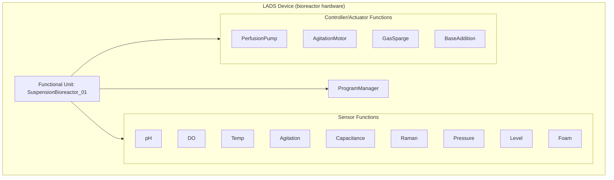
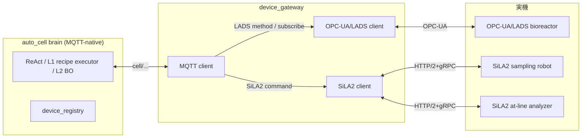
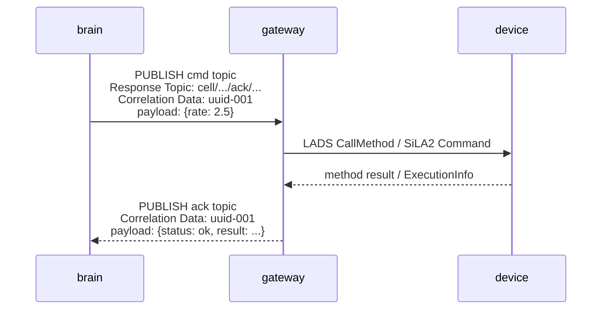
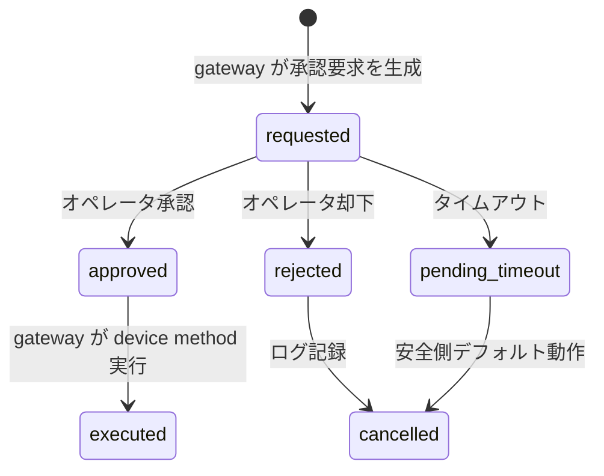

# agent_device_profile — LADS/SiLA2 デバイスプロファイル ICD 草案

> **Mode A 設計根拠レポート**
> 担当エージェント: `agent_device_profile`
> 対象: auto_cell A 層（iPSC 浮遊/凝集体バイオリアクター制御）
> 前提: ADR-0001（L0-L3 分離）, `docs/design/kg_to_auto_cell.md` §7.1-§7.3

---

## 1. Executive Summary

A 層バイオリアクタ本体と周辺ラボ機器のデバイスインターフェースを、**OPC-UA/LADS**（本体）＋ **SiLA2**（周辺機器）＋ **MQTT gateway**（ブレイン結線）の 3 層で具体化する設計根拠をまとめる。

- **LADS** は 2024-01 v1.0.0（OPC 30500-1）でバイオリアクタを「Functional Unit × Function × Program/Result」として明示的にモデル化しており、`auto_cell` の `DomainVertical` slot（`channel_config`/`tool_schemas`/`validate_tool_call`/`event_store`）にほぼ 1:1 で対応する。〔事実: KG `src_lads`/`opcua`〕
- **SiLA2** は HTTP/2+gRPC+FDL でラボ自動化機器（サンプリングロボ、分注、at-line 分析器）を統合する。〔事実: KG `sila`/`src_sila`〕
- **MQTT** は physical-ai-core の既存トランスポートであり、gateway が LADS/SiLA2 側を機械翻訳する。ブレイン側の topic 契約は不変に保つ。〔事実: `kg_to_auto_cell.md` §7.3〕
- すべての副作用コマンドは **request-response + correlation + 冪等キー** で実施し、Human-on-the-loop 承認フローと監査ログを前提とする。〔提案: ADR-0001, FR-4〕

---

## 2. スコープと設計境界

| 対象 | 扱い | 根拠 |
|---|---|---|
| iPSC 浮遊/凝集体バイオリアクター（A 層） | **設計対象** | `requirements.md` §5, `kg_to_auto_cell.md` §1 |
| 閉鎖型ターンキー（Terumo Quantum Flex 等） | **制御対象外**（監視のみ可） | `kg_to_auto_cell.md` §7.1 — CPA 等の閉鎖ソフトで公開 API 確認不可 |
| 双腕汎用ロボ（Maholo 等） | **設計境界**（B 層） | `kg_to_auto_cell.md` §1 |
| 樹立/分化/接着 conf | **設計境界** | `requirements.md` §5 |
| GMP 完全準拠（電子署名・フル CSV） | **R&D 一次として soft 目標** | `requirements.md` §3 NFR-G |

---

## 3. 設計文脈

### 3.1 ADR-0001 による L0-L3 分離

| 層 | 主体 | デバイス側の対応物 | 通信パターン |
|---|---|---|---|
| L0 局所 | デバイス内 PID | LADS `ControllerFunction` / `ActuatorFunction`（局所制御有効） | OPC-UA 監視＋設定点書込 |
| L1 決定的監督 | `loop`/レシピ実行器 | LADS `ActuatorFunction` method / Program 起動 | MQTT `cmd`/`ack` |
| L2 ベイズ最適化 | BO エンジン | Program template パラメタ or `set_perfusion_rate` 等の提案 | オフライン meta-loop |
| L3 LLM オーケストレータ | 承認仲介・例外 | HMI / `gateway` 経由の承認要求 | イベント駆動 |

- L0/L1 の分界は `kg_to_auto_cell.md` §7.2 に従い、温度/pH/DO/撹拌は局所 PID、灌流/給餌/継代はブレイン監督とする。〔事実: KG `ctrl_split`〕
- L3 は **承認フローのみ**に介在し、秒オーダー制御ループを閉じない。〔事実: ADR-0001〕

### 3.2 協業前提 — デバイス側を指定する ICD

実機は協業で改変可能な開 IF 機を前提とする。`devprofile`（KG: `devprofile`）は協業の成果物として、LADS Functional Unit/Function/Program ＋ SiLA2 Feature ＋ MQTT topic 契約を 1 つの ICD に束ねる。〔事実: `kg_to_auto_cell.md` §7.3〕

---

## 4. LADS 情報モデル — iPSC 浮遊バイオリアクター編

### 4.1 LADS 標準の基礎

LADS v1.0.0（OPC 30500-1）は以下の 2 つのビューを定義する。〔事実: OPC Foundation `src_lads`〕

- **Hardware View**: Device → Component → Task（保守・校正・バリデーション）
- **Functional View**: Functional Unit → Function（sensor/controller/actuator/timer）→ Program/Result

LADS の例示として「バイオリアクタを 2 つの Functional Unit に分割する」図が公式リファレンスに含まれている。〔事実: OPC Foundation LADS §4.1.2.2.3〕



### 4.2 Functional Unit: `SuspensionBioreactor`

| 属性 | 値/例 | 備考 |
|---|---|---|
| `FunctionalUnitIdentifier` | `SuspensionBioreactor_{unit_id}` | `culture_unit_id` と一致 |
| `StateMachine` | `FunctionalUnitStateMachineType` | Idle / Running / Held / Complete / Aborted 等〔事実: LADS §4.1.3.5〕 |
| `ProgramManager` | 必須 | seed/passage/perfusion_ramp/clean の template/result 管理 |
| `DeviceHealth` | 任意 | アラーム・保守情報の配信 |

### 4.3 Sensor Function 一覧

LADS の `AnalogSensorFunction` / `DiscreteSensorFunction` / `MultiStateSensorFunction` を使い、`channel_config` の各 channel に対応させる。〔提案: `kg_to_auto_cell.md` §3, §4.2〕

| Channel (`auto_cell`) | LADS Function | 型/単位 | LADS NodeId 例 | 対応 CPP | 備考 |
|---|---|---|---|---|---|
| `ph` | `pH_Sensor` | Analog / pH | `FU/Sensors/pH` | pH 7.1 | L0 PID 監視 |
| `do` | `DO_Sensor` | Analog / % | `FU/Sensors/DO` | DO 40%→10% | L0 PID 監視 |
| `temp` | `Temperature_Sensor` | Analog / °C | `FU/Sensors/Temp` | 37 °C | L0 PID 監視 |
| `agitation` | `Agitation_Sensor` | Analog / rpm | `FU/Sensors/Agitation` | 50–120 rpm | 局所モーター制御値のフィードバック |
| `vcd` | `Capacitance_Sensor` | Analog / pF/cm | `FU/Sensors/VCD` | ~35×10⁶ cells/mL | in-line capacitance、iPSC 校正必須〔事実: P5, PMC8235132, Krause 2023〕 |
| `glucose`/`lactate`/`glutamine` | `Raman_Sensor` | Analog / mM | `FU/Sensors/Raman/{metabolite}` | >1.5 / <50 / >0.01 mM | in-line Raman、iPSC 再校正必須〔事実: P5, Graf/Wei 2022〕 |
| `osmolality` | `Osmolality_Sensor` | Analog / mOsm/kg | `FU/Sensors/Osmolality` | <500 mOsm | Nova at-line から補正可 |
| `aggregate_diameter_um` | `AggregateImaging_Sensor` | Analog / µm | `FU/Sensors/AggregateDiameter` | 150–350 µm | at-line 画像由来。in-line turnkey は未確定〔推定: P5〕 |
| `pressure` | `Pressure_Sensor` | Analog / bar | `FU/Sensors/Pressure` | — | 安全監視 |
| `level` | `Level_Sensor` | Analog / mL | `FU/Sensors/Level` | — | 液量監視 |
| `foam` | `Foam_Sensor` | Discrete / Boolean | `FU/Sensors/Foam` | — | 消泡剤トリガ |

**重要**: 凝集体径は v1 で in-line 連続計測が turnkey 化されていないため、**analog channel としての扱いは維持しつつ cadence は at-line 寄り** とする。〔事実: `kg_to_auto_cell.md` §4.2, §8#3〕

### 4.4 Controller / Actuator Function 一覧

LADS の `ControlFunction`（制御ロジック内蔵）と `ActuatorFunction`（駆動素子）を区別する。〔事実: LADS §7.4〕

| Tool (`auto_cell`) | LADS Function | 型 | 制御主体 | 対応アクション |
|---|---|---|---|---|
| `set_gas_setpoint` | `pH_Controller`, `DO_Controller` | ControlFunction | L0 PID | CO₂/塩基/ガススパージ設定点 |
| `set_agitation_rpm` | `Agitation_Controller` | ControlFunction | L0 PID / L1 監督 | 撹拌 rpm 設定点 |
| `set_perfusion_rate` | `PerfusionPump_Actuator` | ActuatorFunction | **L1 監督** | 0→7 vvd 灌流率（主レバー） |
| `feed` | `FeedPump_Actuator` | ActuatorFunction | L1 監督 | ボーラス給餌 |
| `exchange_media` | `MediaExchange_Actuator` | ActuatorFunction | L1 監督 | 培地交換 |
| `trigger_passage` | `Passage_Program` | Program | L1 監督 | 解離継代シーケンス |
| `take_sample` | `Sampling_Actuator` | ActuatorFunction | L1 監督 | at-line サンプリング |
| `adjust_setpoint` | 各 `*_Controller` | ControlFunction | L0/L1 | 包絡線内設定点変更 |

**制御権限分界**: 温度/pH/DO/撹拌の設定点は局所 PID が即座に追従。ブレインは**検証済包絡線内**の設定点変更のみ出す。〔事実: `kg_to_auto_cell.md` §7.2〕

### 4.5 Program / Result 一覧

LADS の `ProgramManager` は template → active program → result のライフサイクルを持つ。〔事実: LADS §4.1.4〕

| Program ID | 用途 | 引数例 | Result に含まれる主な項目 |
|---|---|---|---|
| `seed` | 播種/接種 | seeding_density, medium_lot | 開始時刻、実際の密度、培地ロット |
| `perfusion_ramp` | 灌流 0→7 vvd 自動立上げ | target_vvd_profile, trigger_conditions | 実灌流履歴、トリガ時刻 |
| `passage` | 解離継代 | dissociation_strength, y27632_conc, target_density | 継代時刻、Y-27632 ロット、再播種密度 |
| `clean` | CIP/SIP | clean_cycle_type | 洗浄終了時刻、温度履歴 |

Program/Result は `event_store` 経由で EBR 導出の原材料となる。〔事実: KG `ebr`/`alcoa`〕

---

## 5. DomainVertical ABC へのマッピング

`kg_to_auto_cell.md` §3 の各 slot と LADS/SiLA2 情報モデルの対応を具体化する。〔提案〕

| ABC slot | LADS/SiLA2 側 | 備考 |
|---|---|---|
| `channel_config()` | LADS `SensorFunction` ノード群 | EU（Engineering Unit）、サンプリング周期、閾値を LADS の `AnalogItemType` から取得 |
| `route_channel()` | SensorFunction の Value → `CellCultureEnv` フィールド | `device_id`/`functional_unit_id`/`function_id` でルーティング |
| `tool_schemas()` | `ControllerFunction` / `ActuatorFunction` の method/property | 引数の型・単位・範囲を LADS FDL 相当で記述 |
| `tool_handlers()` | LADS method call / SiLA2 command invocation | 副作用を gateway 経由で発行 |
| `validate_tool_call()` | ICD に定義した **setpoint envelope** | LADS `AnalogItemType` の EURange + `validate_tool_call` の ramp 制限を両方適用 |
| `detect_events()` | LADS `AlarmConditionType` + `DeviceHealth` | `contamination_suspected` 等を LADS alarm として受信 |
| `event_store` | LADS `Program`/`Result` + `AuditEventType` | 1 run = 1 EBR の導出元 |
| `system_prompt_section()` | ICD 内の「運転方針」メタデータ | LLM に注入する制約・目標値 |

---

## 6. SiLA2 周辺機器プロファイル

### 6.1 標準的な SiLA2 Feature 候補

SiLA2 は Feature Definition Language（FDL）で機能を記述し、HTTP/2+gRPC で通信する。〔事実: `src_sila`, SiLA2 FAQ〕

| 周辺機器 | Feature 例 | 提供データ/機能 | ブレインへの用途 |
|---|---|---|---|
| サンプリングロボ | `SamplingRobot` | `TakeSample(volume, target)` command | `take_sample` tool の実行 |
| 自動分注 | `Dispenser` | `Dispense(volume, source, destination)` command | `feed`/`exchange_media` 実行 |
| at-line 分析器（Nova FLEX2） | `AtLineAnalyzer` | `RunAnalysis(panel)` command, `Result` property | glucose/lactate/gln/osmolality/viability 等のリッチ panel〔事実: Nova FLEX2〕 |
| 凝集体画像（FlowCam/Ovizio） | `AggregateImager` | `Capture()` command, `AggregateDiameter` property | `aggregate_diameter_um` channel |

### 6.2 SiLA2 通信パターン

SiLA2 では 4 つのパターンがある。〔事実: SiLA2.Communication ドキュメント〕

| パターン | gRPC 形式 | 用途例 |
|---|---|---|
| Unobservable Property | Unary | 現在の培地残量 |
| Observable Property | Server Streaming | 連続センサ値（必要に応じて） |
| Unobservable Command | Unary | `TakeSample`（即時完了） |
| Observable Command | 複数 RPC | `RunAnalysis`（進捗＋結果） |

**設計方針**: バイオリアクター本体制御は LADS（OPC-UA）で行い、SiLA2 は周辺機器の「ラボ自動化」に留める。`gateway` が両者を統合する。〔事実: `kg_to_auto_cell.md` §7.1〕

---

## 7. MQTT ↔ LADS/SiLA2 Gateway 設計

### 7.1 アーキテクチャ



### 7.2 MQTT Topic 命名規則

`kg_to_auto_cell.md` §8#1 で決定した prefix を拡張する。〔事実/提案〕

```text
cell/{culture_unit_id}/{direction}/{category}/{device_id}/{function_id}/{aspect}
```

| 方向 | カテゴリ | 用途 | 例 |
|---|---|---|---|
| `telemetry` | `sensor` | LADS SensorFunction の連続値 | `cell/cu-01/telemetry/sensor/bio-01/ph/value` |
| `telemetry` | `state` | FunctionalUnit/DeviceHealth 状態 | `cell/cu-01/telemetry/state/bio-01/functional_unit/state` |
| `event` | `alarm` | LADS alarm / `detect_events` | `cell/cu-01/event/alarm/bio-01/contamination_suspected` |
| `cmd` | `method` | ブレイン → gateway → device method | `cell/cu-01/cmd/method/bio-01/perfusion_pump/set_rate` |
| `ack` | `method` | device → gateway → ブレイン応答 | `cell/cu-01/ack/method/bio-01/perfusion_pump/set_rate` |
| `program` | `control` | Program 起動/進捗/結果 | `cell/cu-01/program/control/bio-01/passage/start` |

**channel は LADS Function 名と一致させる**ことで変換を薄くする。〔事実: `kg_to_auto_cell.md` §8#1〕

### 7.3 Command / Ack / Correlation

MQTT 5.0 の **Response Topic + Correlation Data** を使った request-response。〔事実: OASIS MQTT v5.0 §4.10, EMQ 解説〕



| 項目 | 値/形式 | 目的 |
|---|---|---|
| `correlation_id` | UUIDv4 | 非同期応答の紐付け |
| `request_id` | 冪等キー（UUID or deterministic） | 重複実行防止 |
| `Message Expiry Interval` | 秒単位 | 古いコマンドの廃棄（stale command 防止）〔事実: MQTT 5.0 §3.3.2.3.2〕 |
| `qos` | 1（at-least-once） | コマンドは最低 1 回届くことを保証 |

### 7.4 冪等性とエラーハンドリング

| 状況 | 挙動 | 根拠 |
|---|---|---|
| 同じ `request_id` の再送信 | device/gateway 側で重複排除。既に完了なら結果を返す。 | NFR-R（可用性・再起動耐性） |
| device 応答なし（タイムアウト） | `ack` に `status: timeout`、L1 は **最後の検証済設定点** を維持 | NFR-S（安全） |
| device 側エラー | `status: error` + LADS/SiLA2 reason code をそのまま転送 | 監査性 |
| gateway → ブレイン断 | device 側は L0 局所 PID で継続。ブレイン復帰後に状態再同期 | NFR-S（縮退運転） |
| 包絡線逸脱コマンド | gateway は `validate_tool_call` と二重チェックし拒否 | FR-4, `kg_to_auto_cell.md` §3 |

**二重検証**: `validate_tool_call`（ブレイン側）と gateway 側の ICD envelope チェックの両方を通す。〔提案〕

### 7.5 フォールバック梯子

相手機器が LADS/SiLA2 を実装できない場合の退避。〔事実/提案: `kg_to_auto_cell.md` §7.3〕

```
OPC-UA + LADS  →  OPC-UA custom nodeset  →  MQTT Sparkplug B  →  gRPC  →  REST
```

- ブレイン側 MQTT 契約は不変。
- gateway 内部で device 側アダプタを差替可能にする。

---

## 8. Human-on-the-loop 承認フロー

ADR-0001 と `requirements.md` FR-4 に従い、以下のアクションは承認を要する。〔事実〕

| アクション | 承認要否 | MQTT 表現 | タイムアウト時のデフォルト |
|---|---|---|---|
| 包絡線外の setpoint 変更 | **要承認** | `cmd/method/.../adjust_setpoint` → HMI 要求 | 変更を **実施しない**（安全側） |
| `trigger_passage`（解離継代） | **要承認** | `program/control/.../passage/start` → 承認待ち | 保留、L0/L1 は継続運転 |
| BO 提案の採用（L2） | **要承認** | L2 → L3 承認要求 | 棄却、現パラメタ維持 |
| 緊急停止/ホールド | **安全系が強制**（承認不要） | `event/alarm/.../emergency_stop` | — |
| 包絡線内 `set_perfusion_rate` | 自動実行 | `cmd/method/.../set_rate` | — |

### 8.1 承認状態遷移



- 承認要求は MQTT `event/approval_request/...` に publish。
- 承認/却下は `cmd/approval/...` で応答。
- すべての遷移は `event_store` に不変ログ化。〔提案: ALCOA+〕

---

## 9. セキュリティ・ALCOA+・データインテグリティ

| ALCOA+ | 実装方針 | LADS/SiLA2/MQTT での担保 |
|---|---|---|
| Attributable | ユーザー ID + device ID + gateway ID をログに紐付け | MQTT user property / LADS AuditEventType |
| Legible/Contemporaneous | すべての値に UTC timestamp + unit | LADS `AnalogItemType` の EU、SiLA2 timestamp |
| Original/Accurate | gateway は生データを書き換えない。単位換算のみ可。 | MQTT payload format indicator |
| Complete/Consistent/Enduring/Available | event_store に永続化、バックアップ | Program/Result + audit trail |

- OPC-UA/LADS は認証/署名/暗号化を内蔵しており、Part11/GMP 対応の土台となる。〔推定: `kg_to_auto_cell.md` §7.3〕
- R&D 一次では電子署名を **soft 目標** とし、承認フローはユーザー認証＋監査ログで代替する。〔事実: `requirements.md` §3 NFR-G〕

---

## 10. 未確定事項・フォローアップ

| # | 項目 | 重要度 | 次ステップ |
|---|---|---|---|
| 1 | LADS 情報モデルのベンダー間互換テスト | 高 | 協業先機器で `lads-client-py` 等を用いた接続確認 |
| 2 | SiLA2 Feature の FDL 詳細（サンプリングロボ、Nova FLEX2） | 中 | 機器ベンダー毎の FDL 取得・プロファイル化 |
| 3 | MQTT message expiry / dead letter ポリシー | 中 | broker 設定とテストケース作成 |
| 4 | gateway の冪等ストア実装方式（Redis/in-memory） | 中 | 可用性要件と整合 |
| 5 | LADS `Program`/`Result` からの EBR 導出スキーマ | 低（後段） | Agent E と統合 |
| 6 | 閉鎖ターンキー機（Terumo 等）からの読出し IF | 低 | 監視データ連携が必要になった場合 |

---

## 11. トレーサビリティ

| 設計要素 | 対応 KG ノード |
|---|---|
| デバイス IF 全体 | `opcua`, `sila`, `gateway`, `devprofile` |
| LADS 標準 | `src_lads` |
| SiLA2 標準 | `src_sila` |
| 制御権限分界 | `ctrl_split`, `loop` |
| CPP/設定点包絡線 | `qccrit`, `kinetics`, `src_manstein`, `src_borys` |
| 観測性スタック | `cpv`, `envmon`, `edge` |
| 規制制約 | `alcoa`, `part11`, `audit`, `ebr` |

---

## 12. 出典

1. OPC Foundation. *OPC UA for Laboratory & Analytical Device Standard (LADS) Part 1: Basics*, OPC 30500-1, v1.0.0 (2024-01). https://reference.opcfoundation.org/specs/OPC-30500-1/4.1
2. SLAS. *OPC UA LADS*. https://www.slas.org/resources/standards/opc-ua-lads/
3. OASIS. *MQTT Version 5.0* (2019-03). https://docs.oasis-open.org/mqtt/mqtt/v5.0/mqtt-v5.0.html
4. EMQ. *MQTT Request / Response Explained and Example* (2024-08). https://www.emqx.com/en/blog/mqtt5-request-response
5. SiLA Consortium. *SiLA 2 FAQ*. https://sila-standard.com/faq/
6. SiLA2.Communication / NuGet. *Runtime Dynamic Protobuf Generation for SiLA2 Features*. https://www.nuget.org/packages/SiLA2.Communication
7. Nova Biomedical. *BioProfile FLEX2*. https://www.novabiomedical.com/cell-culture-analyzers/bioprofile-flex2-basic/
8. Manstein et al. 2021. *Stem Cells Transl Med* 10(7):1063-1080. DOI:10.1002/sctm.20-0453, PMID:33660952.
9. Manstein et al. 2021. *STAR Protocols* 2(4):100988. PMC8666714.
10. Borys et al. 2021. *Stem Cell Res Ther* 12:55. PMC7805206.
11. Krause et al. 2023. *Curr Opin Biotechnol* — biocapacitance online biomass. https://www.sciencedirect.com/science/article/pii/S0958166923000897
12. Graf/Wei et al. 2022. *Front Bioeng* — in-line Raman closed-loop glucose PID. https://www.frontiersin.org/journals/bioengineering-and-biotechnology/articles/10.3389/fbioe.2022.719614/full
13. `docs/design/kg_to_auto_cell.md` §7.1-§7.3 / §8.
14. `docs/design/adr/0001-control-architecture.md`.
15. `docs/design/requirements.md` §2-§3.
