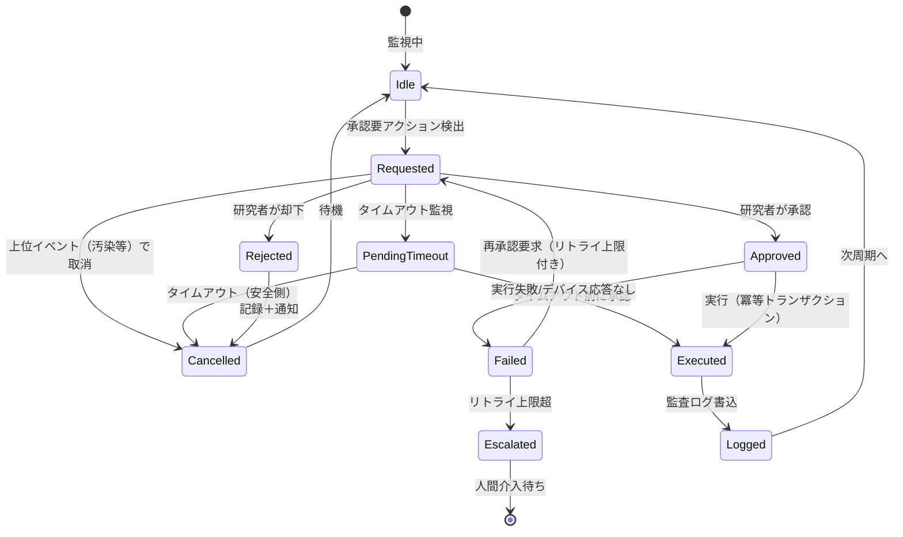
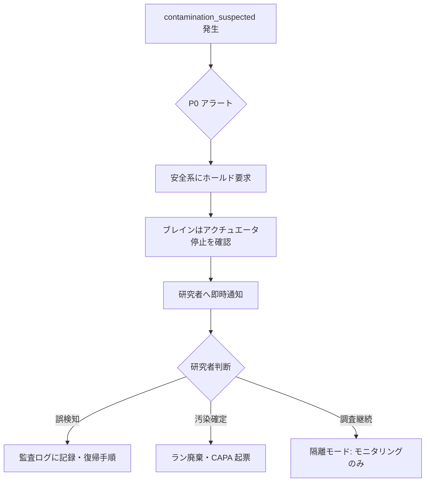

# Agent G: HMI・承認・異常処理ワークフロー設計根拠

**Agent**: `agent_hmi_workflow`  
**Mode A**: 設計根拠レポート  
**Scope**: auto_cell A 層（iPSC 浮遊/凝集体バイオリアクター制御）  
**前提**: ADR-0001（L0 局所 PID + L1 決定的レシピ/ルール + L2 ベイズ最適化 + L3 薄い LLM オーケストレータ）、Human-on-the-loop、R&D/プロセス開発一次  

---

## 0. 要約

A 層制御では、ブレインは高速/安全ループを閉じず、監督制御の設定点変更・離散アクション・継代・BO 提案採用を行う。本書はこれらのアクションに対する **Human-on-the-loop（HotL）承認ワークフロー**、**通知/アラート設計**、**異常時の縮退運転**を設計根拠付きで定義する。基本方針は「定常は決定的自律、逸脱/重大アクションは人へ承認要求」である。なお、樹立/分化/双腕/接着 conf は A 層スコープ外であり、本書では「設計境界」として参照しない。

---

## 1. 前提と設計境界

| 項目 | 内容 | 出典/根拠 |
|---|---|---|
| 制御アーキ | L0-L3 分離。L3 LLM はイベント駆動・非常駐 | ADR-0001; KG `loop`, `ctrl_split` |
| 運転形態 | Human-on-the-loop：定常は自律、包絡線外/重大アクションは人承認 | `docs/design/requirements.md` §前提; KG `loop` |
| 対象プロセス | iPSC 浮遊/凝集体、Manstein 型灌流 0→7 vvd、目標 ~35×10⁶ cells/mL | `docs/design/kg_to_auto_cell.md` §0/§4.1; KG `src_manstein` |
| スコープ外 | 樹立（`reprog`）、分化（`diff`）、双腕（`dualarm`）、接着 conf（`conf`） | `docs/design/requirements.md` §5; `kg_to_auto_cell.md` §1 |

---

## 2. 承認が必要なアクション一覧

以下は L1/L2/L3 が自律実行しようとするが、**人の明示承認を要するアクション**とする。判定基準は (1) CPP 検証済包絡線を逸脱するか、(2) 細胞品質に不可逆影響を与えるか、(3) 安全/無菌に関わるか、のいずれか。

| アクション | トリガ | 承認理由 | 既定タイムアウト | タイムアウト時動作 | 事実/推定 | 出典/KG |
|---|---|---|---|---|---|---|
| `set_perfusion_rate` 包絡線外 | L1 ルール/BO 提案 | 灌流は主レバー、急激なシア/浸透圧変化を避ける | 10 min | **キャンセル**（現状維持） | 推定 | `kg_to_auto_cell.md` §7.2; KG `loop`, `dispense` |
| `set_agitation_rpm` 包絡線外（>120/<50 rpm） | 凝集体径逸脱/BO 提案 | シアストレス・凝集体壊死リスク | 10 min | キャンセル | 推定 | KG `src_borys`; `kg_to_auto_cell.md` §4 |
| `set_gas_setpoint` 包絡線外（DO/pH） | 高密度化/BO 提案 | 細胞生存・品質に影響 | 10 min | キャンセル | 推定 | KG `envmon`, `src_manstein` |
| `trigger_passage`（解離継代） | VCD 目標到達/凝集体径超過 | 不可逆な操作、Y-27632 添加・シア管理が品質を左右 | 30 min | **保留**/研究者不在時は安全側でホールド | 推定 | `kg_to_auto_cell.md` §4; KG `passage` |
| BO 提案の採用（`propose_next_run`） | L2 ベイズ最適化 | 次 run の条件を確定、探索空間外の提案もあり得る | 24 h（run 間） | **キャンセル**、現行レシピ継続 | 推定 | ADR-0001; KG `bbo`, `doe` |
| 緊急停止/ホールド | 汚染疑い/重大逸脱 | 安全系連動、ブレインは要求のみ | 即時（承認不要、ただし監査ログ必須） | 安全系が強制停止 | 事実 | `requirements.md` §3; KG `sterility`, `capa` |
| `exchange_media` 大容量/頻回 | 乳酸/浸透圧異常 | 培地交換はコスト・細胞ストレス要因 | 10 min | キャンセル | 推定 | KG `suspension`, `cpv` |
| `feed` 高濃度添加 | グルコース/グルタミン低 | osmolality 上昇リスク | 10 min | キャンセル | 推定 | KG `kinetics`, `maint` |

> **設計境界**: 上記タイムアウト値は運用仮値。R&D 一次では運用マニュアルで調整可。GMP 移行時は電子署名・承認者ロールで再定義が必要（`part11`, `ebr`）。

---

## 3. 承認状態遷移

### 3.1 状態遷移図



### 3.2 状態遷移の詳細

| 遷移 | 条件 | 副作用 | 監査項目 |
|---|---|---|---|
| `Requested` | L1/L2/L3 が承認要判定 | HMI 通知、 researcher へ push | 要求 ID、要求者（システム/エージェント）、提案内容、根拠、タイムスタンプ | 推定 | `requirements.md` FR-4; KG `audit`, `part11` |
| `Approved` | 研究者が UI/ボタンで承認 | 実行トークン発行 | 承認者 ID、承認時刻、承認内容ハッシュ | 推定 | KG `part11`, `alcoa` |
| `Rejected` | 研究者が却下 | キャンセル、理由入力を必須化 | 却下理由、却下者 ID | 推定 | KG `audit` |
| `PendingTimeout` | タイマー起動 | 残り時間を HMI 表示 | タイムアウト閾値 | 推定 | — |
| `Cancelled`（タイムアウト） | 安全側へ倒す | 現状維持、通知 | タイムアウト事由 | 推定 | NFR-S |
| `Executed` | 承認トークン検証後 | デバイスメソッド呼出し | 実行者、実行結果、ack correlation ID | 推定 | `kg_to_auto_cell.md` §7.3 |
| `Failed` | デバイス応答なし/範囲外 | リトライ or エスカレーション | エラー詳細 | 推定 | — |

**重要**: 承認は **冪等トランザクション** とする。同一承認トークンで二重実行しない。これは `requirements.md` NFR-R（冪等性）と `kg_to_auto_cell.md` §7.3 の method 呼び出し設計に一致する。

---

## 4. 通知・アラートマトリクス

### 4.1 イベント優先度と抑制

| イベント | 優先度 | 抑制窓 | 通知チャネル | 既定動作 | 根拠 |
|---|---|---|---|---|---|
| `contamination_suspected` | **P0 即時** | 0 s（抑制不可） | SMS/Call + HMI 全画面 + 監査 | 安全系ホールド要求 | `kg_to_auto_cell.md` §5; KG `sterility`, `capa` |
| `do_low` | P1 緊急 | 300 s | HMI + push | L0 ガス/撹拌カスケード起動、L1 は設定点再評価 | `kg_to_auto_cell.md` §4; KG `envmon` |
| `ph_out_of_range` | P1 緊急 | 300 s | HMI + push | L0 CO₂/塩基制御起動 | KG `envmon` |
| `lactate_high` | P2 重要 | 600 s | HMI + push | 灌流/交換提案 | KG `suspension`, `cpv` |
| `glucose_low` / `glutamine_low` | P2 重要 | 600 s | HMI + push | 給餌/灌流提案 | KG `maint`, `kinetics` |
| `osmolality_high` | P2 重要 | 600 s | HMI + push | 灌流率見直し提案 | KG `suspension`, `kinetics` |
| `aggregate_out_of_range` | P2 重要 | 600 s | HMI + push | 撹拌/継代提案 | KG `suspension`, `src_borys` |
| `vcd_target_reached` | P3 情報 | 0 s（毎回） | HMI + push | `trigger_passage` 承認要求 | KG `growth` |
| `shear_risk` | P2 重要 | 300 s | HMI | 撹拌 rpm 抑制要求 | 推定 | KG `passage`, `src_borys` |
| `approval_requested` | P2 重要 | 0 s | HMI + push | 待機 | 推定 | — |
| `bo_proposal_ready` | P3 情報 | 86400 s（1 回/run） | HMI + メール | 承認要求 | 推定 | KG `bbo` |
| `temp_out_of_range` | P1 緊急 | 60 s | HMI + push | L0 ヒーター制御 | KG `envmon` |

> **事実**: 上記の多くは `kg_to_auto_cell.md` §4/§5 で既にイベント化されている。  
> **推定**: 優先度/抑制窓/通知チャネルは運用仮値。R&D 一次では実験室内運用に合わせ調整可能。

### 4.2 抑制とフラッディング防止

`suppression_defaults` は `DomainVertical.event_descriptions()` で定義する。同一イベントが suppress window 内に再発した場合、HMI にはカウントアップのみ行い push は抑制する。ただし `contamination_suspected` は suppress=0 で一切抑制しない。これは `kg_to_auto_cell.md` §3 と一致する。

---

## 5. HMI 画面構成案

### 5.1 画面一覧（R&D 一次向け）

| 画面 | 主要表示内容 | 操作 | 対応 KG |
|---|---|---|---|
| **ダッシュボード（メイン）** | 現在の CPP 値・トレンド・培養日齢・phase・承認待ち件数 | — | `loop`, `envmon`, `cpv` |
| **承認キュー** | 承認要求リスト、根拠、提案前後の状態比較、承認/却下/保留 | 承認操作 | `approval_workflow`（新規） |
| **アラート履歴** | アラート優先度、発生時刻、抑制カウント、対応状態 | 対応記録 | `audit`, `capa` |
| **培養状態詳細** | VCD/生細胞率・代謝物・凝集体径・灌流率の時系列 | — | `growth`, `kinetics`, `cpv` |
| **BO 提案レビュー** | 次 run 提案パラメタ、予測分布、制約充足確認 | 承認/修正/却下 | `bbo`, `doe` |
| **監査/EBR ビュー** | 操作ログ、イベントストア、EBR 再構成 | 検索/エクスポート | `audit`, `ebr`, `alcoa` |
| **設定・包絡線** | CPP 範囲、抑制窓、通知先、承認タイムアウト | 管理者変更（監査対象） | `csv`, `qccrit` |

### 5.2 ダッシュボード表示例（概念）

```text
┌─────────────────────────────────────────────────────────────┐
│ Unit: BR-01 │ Phase: perfusion-day-5 │ Age: 5.2 d            │
├─────────────────────────────────────────────────────────────┤
│ CPP 現在値      目標/範囲        トレンド    状態            │
│ pH           7.10     7.1       →           OK              │
│ DO           28 %     40→10%    ↘           OK(目標遷移中)   │
│ Agitation    80 rpm   50-120    →           OK              │
│ Glucose      2.1 mM   >1.5      →           OK              │
│ Lactate      34 mM    <50       ↗           要注意            │
│ Osmolality   420      <500      ↗           OK              │
│ Aggregate    280 µm   150-350   →           OK              │
│ VCD          18.5e6   ~35e6     ↗           増殖中            │
├─────────────────────────────────────────────────────────────┤
│ [承認待ち: 1] trigger_passage 提案 — 根拠: VCD 目標到達予測   │
│ [P0] contamination_suspected — 自動ホールド要求中            │
└─────────────────────────────────────────────────────────────┘
```

> **推定**: レイアウトは UI/UX 設計の出発点。実装時には研究者フィードバックを反映する。

---

## 6. 異常時運転マニュアル案

### 6.1 汚染疑い検知時（`contamination_suspected`）



- ブレインは**停止要求のみ**を出し、実際の停止は安全系/デバイス局所が強制する（`ctrl_split`）。
- 復帰には研究者の明示操作と CAPA 起票を要する（`capa`）。

### 6.2 ブレイン/通信断時の縮退運転

| 事象 | L0/L1 の動作 | HMI/通知 | 備考 |
|---|---|---|---|
| ブレイン停止 | L0 局所 PID は継続。L1 は最終検証済レシピで継続可能 | 研究者へ offline 通知 | `requirements.md` NFR-S, NFR-R |
| MQTT 通信断 | デバイス局所制御継続、gateway 側バッファリング | 通信断アラート | `kg_to_auto_cell.md` §7.1 |
| L3 LLM 停止 | L0/L1/L2 は独立動作。LLM 依存機能のみ停止 | LLM サービス断アラート | ADR-0001 |
| 研究者不在 | 承認要求はタイムアウト→キャンセル/ホールド | 自動応答を監査ログへ | 推定 |

> **事実**: ADR-0001 と `requirements.md` NFR-S/NFR-R において、LLM/ブレイン不在でも L0/L1/L2 は継続する。  
> **推定**: 研究者不在時のデフォルト動作はアクション別に定義する（§2）。

### 6.3 緊急停止/ハード保安連動

- 緊急停止ボタン、無菌バリア破損、ハード保安連動は **ブレインが触れない領域**。
- ブレインはこれらの状態を **perceive のみ**行い、HMI 表示と監査ログ記録を行う。
- 復帰はデバイス側の手順と研究者の確認が必要。

---

## 7. L3 薄い LLM オーケストレータの役割

ADR-0001 における L3 LLM は以下の HotL/UX タスクに限定される。

| タスク | LLM の入り口 | 備考 |
|---|---|---|
| 承認根拠の自然言語要約 | `approval_requested` イベント | 状態変化・適用ルール・予測影響を要約 |
| 異常イベントの文脈説明 | `contamination_suspected`, `lactate_high` 等 | 複数 CPP の相関を説明 |
| BO 提案の説明 | `bo_proposal_ready` | 探索空間・制約・予測改善度を説明 |
| 研究者からの自然言語問い合わせ | HMI チャット | 培養状態・履歴・操作理由を返答 |
| 新規例外の dispatch | 未定義イベント | 類似イベントへのマッピング案を提示（人が承認） |

> **推定**: LLM の HMI 説明機能は「信頼性向上」のための付加価値。v1 ではオプション導入可能（ADR-0001 Consequences）。

---

## 8. 監査・トレーサビリティ

承認ワークフローは `audit`/`ebr` 要件を満たす以下のフィールドを event_store に書き込む。

```json
{
  "event_type": "approval_requested",
  "request_id": "uuid",
  "actor_system": "auto_cell/L1_recipe_executor",
  "proposed_action": "set_perfusion_rate",
  "proposed_args": {"vvd": 4.5},
  "rationale": "glucose_low + lactate_trend",
  "requested_at": "2026-06-16T04:20:00Z",
  "reviewer": "researcher_001",
  "decision": "approved",
  "decided_at": "2026-06-16T04:22:00Z",
  "execution_id": "uuid",
  "device_ack_id": "lads_ack_123"
}
```

- 全フィールドは変更不可（append-only）。`alcoa` の Attributable/Contemporaneous/Original/Accurate を満たす。
- `ebr` は 1 run 分のイベントストアを時系列で再構成したビュー（`kg_to_auto_cell.md` §5）。

---

## 9. 未確定事項・調査継続

| # | 項目 | 理由 | 次アクション |
|---|---|---|---|
| 1 | 承認タイムアウト値の最適化 | 10 min/30 min/24 h は運用仮値。細胞種・運転形態により変わる | パイロット運転で調整 |
| 2 | 電子署名の実装レベル | R&D 一次では緩いが、GMP 移行を見据えると Part11 対応が必要 | `agent_regulatory_controls` 出力と統合 |
| 3 | HMI レイアウトのユーザビリティ検証 | 推定段階。研究者の現場フィードバックが必要 | UX プロトタイプ評価 |
| 4 | LLM 説明の信頼性評価 | ハルシネーションリスク。R&D 一次では監視下運用 | 説明ログの正確性監査 |
| 5 | 複数バイオリアクタ並行時の承認キュー優先度 | 複数 unit の同時承認要求時の優先度ルール未定 | スケジューラ設計時に解決 |

---

## 10. 出典一覧

| ID | タイトル | URL/DOI/PMID/PMCID | 主張タイプ |
|---|---|---|---|
| ADR-0001 | Control architecture — thin LLM orchestrator | `docs/design/adr/0001-control-architecture.md` | 事実（設計決定） |
| requirements | auto_cell A 層要求仕様 | `docs/design/requirements.md` | 事実 |
| kg_bridge | KG → auto_cell 設計ブリッジ | `docs/design/kg_to_auto_cell.md` | 事実 |
| src_manstein | Manstein & Zweigerdt 2021 | DOI 10.1002/sctm.20-0453, PMID 33660952, PMC8666714 | 事実 |
| src_borys | Borys et al. 2021 | PMC7805206 | 事実 |
| src_lads | OPC UA for LADS v1.0.0 | https://reference.opcfoundation.org/LADS/v100/docs/ | 事実 |
| src_cxa | CellXpress.ai 適用ノート | `knowledge_graph.json` 経由 | 参照 |
| src_cgt | CGT QC/QA（ALCOA, Part 11, CAPA） | https://www.cellandgene.com/topic/cell-gene-therapy-qa-qc | 参照 |

---

## 11. トレーサビリティ（KG ノード）

| 本書セクション | 関連 KG ノード |
|---|---|
| 承認ワークフロー | `loop`, `sched`, `audit`, `part11`, `ebr`, `approval_workflow`（新規） |
| アラート/通知 | `loop`, `capa`, `sterility`, `envmon`, `cpv`, `alert_matrix`（新規） |
| HMI | `loop`, `envmon`, `cpv`, `bbo`, `hmi_dashboard`（新規） |
| 異常処理 | `sterility`, `capa`, `ctrl_split`, `contamination_response`（新規）, `degraded_mode`（新規） |

---

*Generated by `agent_hmi_workflow` for auto_cell A-layer.*
