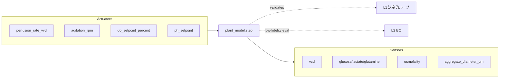

# Agent F — Tier2 `plant_model` 設計根拠レポート

> **担当**: `agent_plant_model`（プロセスモデリング/シミュレーション）  
> **対象**: auto_cell A 層 — iPSC 浮遊/凝集体バイオリアクター制御  
> **前提**: ADR-0001（L0-L3 分離、Human-on-the-loop）、`docs/design/kg_to_auto_cell.md` §4.1/§6、`docs/design/requirements.md`  
> **生成日**: 2026-06-16

---

## 1. 要約

本レポートは、auto_cell の Tier2 シミュレーション層 `sim/plant_model` を、文献に接地させつつ A 層制御アーキテクチャ（ADR-0001）に組み込むための設計根拠を整理したものである。

- **原典は Manstein & Zweigerdt 2021**（SCTM 10(7):1063-1080 / STAR Protocols 2(4):100988）であり、`plant_model/__init__.py` の 6 項 Monod 定数・検証軌道（7 日で ~35×10⁶ cells/mL、DO 40%→10%、pH 7.1）とも一致する。〔事実：PMC8666714, PMID 33660952〕
- `plant_model` は **L1 決定的制御ループの検証リグ**であり、**L2 ベイズ最適化の低忠実度サロゲート**として使う。〔設計提案〕
- 物理プロセスは **灌流（0→7 vvd）前提**であり、標準バッチでは到達しない。〔事実：PMC6744632, PMC3460618〕
- 現時点で ODE 本体は未実装（docstring のみ）。本稿では `step(actuators) -> sensors` IF、パラメータ同定・不確実性表現、CI/回帰テスト、将来の COBRApy+GEM 等への差替路線図を示す。〔設計提案/未確定〕

---

## 2. 前提・スコープ・設計境界

### 2.1 A 層スコープ

- **対象**: iPSC 浮遊/凝集体バイオリアクター内のプロセス（Manstein 型灌流、目標密度 ~35×10⁶ cells/mL）。
- **対象外（設計境界）**: iPSC 樹立、分化誘導、双腕ロボ、接着 2D 培養。これらは将来の最適化対象・文脈情報として参照するが、本 plant_model ではモデル化しない。〔`docs/design/kg_to_auto_cell.md` §1〕

### 2.2 ADR-0001 における位置づけ

| 層 | plant_model との関係 |
|---|---|
| L0 局所 PID | モデルは PID の入出力を模倣しない。温度/pH/DO/撹拌の高速ループはデバイス側。〔ADR-0001〕 |
| L1 決定的レシピ/ルール | plant_model は L1 の **検証リグ**。同一アクチュエータ系列 → 同一センサ軌道を保証する。〔設計提案〕 |
| L2 ベイズ最適化 | plant_model は **低忠実度評価関数**。実 run 前のパラメータスクリーニングに使う。〔設計提案〕 |
| L3 LLM オーケストレータ | plant_model は L3 に直接繋がらない。L3 はイベント駆動・承認仲介のみ。〔ADR-0001〕 |

### 2.3 Human-on-the-loop

- plant_model 自身はアクチュエータを駆動しない。〔設計提案〕
- L2 BO が plant_model 上で評価した提案（灌流スケジュール、設定点変更）が包絡線を超える場合、人の承認が必要。〔`requirements.md` FR-4〕

---

## 3. ODE 構造

### 3.1 原典モデルの概要

Manstein 2021 の in silico モデルは、クラシックな Monod 速度論を拡張した 6 項モデルである。〔PMC8666714〕

- 比増殖速度を、**glucose、lactate、glutamine、osmolality、aggregate size、perfusion rate** の項で表現。
- 表 1 の kinetic constants が `plant_model/__init__.py` の定数と一致。〔`sim/plant_model/__init__.py`, PMC8666714〕
- 灌流レートは 0→7 vvd に段階的に増加（STAR Protocols 表 3）。〔PMC8666714〕

### 3.2 状態変数

A 層の `CellCultureEnv` と対応する状態変数を以下とする。〔`docs/design/kg_to_auto_cell.md` §3/§4〕

| 記号 | 変数名 | 単位 | 備考 |
|---|---|---|---|
| X | `vcd` | cells/mL | 生存細胞密度 |
| G | `glucose` | mM | グルコース濃度 |
| L | `lactate` | mM | 乳酸濃度 |
| Q | `glutamine` | mM | グルタミン濃度 |
| O | `osmolality` | mOsm/kg | 浸透圧 |
| D | `aggregate_diameter_um` | µm | 平均凝集体径 |
| P | `perfusion_rate_vvd` | 1/d | 灌流レート（アクチュエータ入力） |

### 3.3 比増殖速度式

```text
μ = μmax · f_Glc · f_Lac · f_Gln · f_Osm · f_Agg

f_Glc = G / (G + K_Glc)
f_Lac = K_Lac / (L + K_Lac)
f_Gln = Q / (Q + K_Gln)
f_Osm = K_Osm / (O + K_Osm)
f_Agg = K_Agg / (D + K_Agg)   ← 直径項として実装
```

- `K_Agg = 175 µm` は **直径**として解釈する。Table 1 は「KAgg [μm] = 350/2」と明記している。〔PMC8666714〕
- Galvanauskas 2019 では `K_Agg` を凝集体**体積**（µm³）として扱う別モデルが存在するが、Manstein 2021 とは別物。〔PMC6933447〕
- `f_Agg` の函数形（直径項 vs 体積項）は、将来の実測データが得られたら検証・修正の対象。〔未確定/推定〕

### 3.4 物質収支

細胞保持型灌流（cell retention perfusion）を前提とする。〔PMC8666714〕

```text
dX/dt = μ · X

dG/dt = -q_Glc · X + P · (G_feed - G)
dL/dt =  q_Lac · X - P · L
dQ/dt = -q_Gln · X + P · (Q_feed - Q)
dO/dt =  φ_O(X, G, L, Q, base_addition) - P · (O - O_feed)
dD/dt =  φ_D(X, D, agitation_rpm, aggf, aggg)
```

- `P` は vvd（working volume/day）で、培地交換による代謝物希釈・栄養供給を表す。〔PMC8666714〕
- `φ_O`（浸透圧変化）と `φ_D`（凝集体成長）の詳細な函数形は、原典の「Data S1」に依存する。STAR Protocols には定数 `aggf=0.95`、`aggg=0.25` が示されているが、ODE の完全な記述は本調査で取得できなかった。〔PMC8666714, 未確定〕
- 実装 v1 では、`φ_O` は乳酸・グルコース・塩基添加の経験的相関、`φ_D` は撹拌速度に依存する経験式で近似し、後に原典コードまたは実データで校正する。〔推定〕

### 3.5 パラメタ表

| パラメタ | plant_model 値 | 原典 Manstein 2021 表 1 | 不確実性 |
|---|---|---|---|
| μmax | 1.35 /d | 1.35 /d | 事実：一致〔PMC8666714〕 |
| K_Glc | 1.5 mM | 1.5 mM | 事実：一致〔PMC8666714〕 |
| K_Lac | 50 mM | 50 mM | 事実：一致〔PMC8666714〕 |
| K_Gln | 0.01 mM | 0.01 mM | 事実：一致〔PMC8666714〕 |
| K_Osm | 500 mOsm/kg | 500 mOsm/kg | 事実：一致〔PMC8666714〕 |
| K_Agg | 175 µm（径） | 350/2 µm（径） | 事実：一致〔PMC8666714〕 |
| q_Glc | 1.474×10⁻⁸ mmol/cell/d | 1.474×10⁻⁸ | 事実：一致〔PMC8666714〕 |
| q_Lac | 2.37×10⁻⁸ mmol/cell/d | 2.37×10⁻⁸ | 事実：一致〔PMC8666714〕 |
| q_Gln | 1.856×10⁻⁹ mmol/cell/d | 1.856×10⁻⁹ | 事実：一致〔PMC8666714〕 |
| aggf | — | 0.95 | 未実装〔PMC8666714, 未確定〕 |
| aggg | — | 0.25 | 未実装〔PMC8666714, 未確定〕 |

### 3.6 検証目標

| 指標 | 目標値 | 出典 |
|---|---|---|
| 到達密度 | ~35×10⁶ cells/mL（day 7） | Manstein 2021〔PMID 33660952, PMC8666714〕 |
| 拡大倍数 | ~70 倍（seed 0.5×10⁶/mL） | Manstein 2021〔PMC8666714〕 |
| DO | 40% → 10%（days 6-7） | Manstein 2021〔PMC8666714〕 |
| pH | 7.1 | Manstein 2021〔PMC8666714〕 |
| 凝集体径 | 150–350 µm（day 7） | Manstein 2021〔PMC8666714〕 |
| 撹拌 | 80 rpm@150 mL（スケール依存） | Manstein 2021〔PMC8666714〕 |

> 標準バッチでは Nogueira 2019（Vertical-Wheel）で 2.3×10⁶、Olmer 2012（撹拌槽）で 2.4×10⁶ cells/mL にとどまる。〔PMC6744632, PMC3460618〕35×10⁶ cells/mL は**灌流前提**の目標値である。〔事実〕

---

## 4. `step(actuators) -> sensors` IF 設計

### 4.1 設計思想

- `plant_model` は **離散時間シミュレータ**であり、L1 制御ループや L2 BO から「このアクチュエータ系列を使ったらどうなるか」を問われる。〔設計提案〕
- 入出力は `pydantic.BaseModel` で型付けし、単位・範囲を明示する。〔設計提案〕
- 内部状態は `CellCultureEnv` のサブセットを保持し、呼び出し間で連続する。〔設計提案〕

### 4.2 入力：actuators

```python
class PlantActuators(BaseModel):
    perfusion_rate_vvd: float = Field(..., ge=0.0, le=10.0)
    agitation_rpm: float = Field(..., ge=0.0, le=200.0)
    do_setpoint_percent: float = Field(..., ge=0.0, le=100.0)
    ph_setpoint: float = Field(..., ge=6.8, le=7.4)
    feed_glucose_mM: float | None = None   # ボーラス/培地組成
    feed_glutamine_mM: float | None = None
```

- `perfusion_rate_vvd` は主レバー。Manstein 2021 では 0→7 vvd。〔PMC8666714〕
- `agitation_rpm` は凝集体径制御に影響。Borys 2021 では Vertical-Wheel で 40 rpm が最適、>400 µm で壊死リスク。〔PMC7805206〕auto_cell の包絡線 50–120 rpm は上限が高め。〔`docs/design/kg_to_auto_cell.md` §4.1〕
- `do_setpoint_percent` / `ph_setpoint` は L0 PID の目標値。plant_model では L0 の応答を簡易モデル（時定数・飽和）で近似。〔推定〕

### 4.3 出力：sensors

```python
class PlantSensors(BaseModel):
    vcd: float                    # cells/mL
    viability: float              # 0-1
    glucose: float                # mM
    lactate: float                # mM
    glutamine: float              # mM
    osmolality: float             # mOsm/kg
    aggregate_diameter_um: float  # µm
    do_percent: float
    ph: float
    temp_c: float = 37.0
```

### 4.4 決定性契約

- **同一 `actuators` 系列 + 同一初期状態 → 同一 `sensors` 軌道**。これを CI で固定する。〔設計提案：CSV/CSA 観点〕
- 数値積分は SciPy `solve_ivp`（`LSODA` または `Radau`）を推奨。〔推定：数値計算 source〕
- 乱数を使わない。パラメータ不確実性は BO の外部で事後分布として扱う。〔設計提案〕

### 4.5 インターフェース図



---

## 5. パラメータ同定・不確実性表現

### 5.1 実データがない段階での使い方

- 文献値（Manstein 2021 Table 1）を **事前分布（prior）** とする。〔PMC8666714〕
- セルライン・装置スケールによる差異を吸収するため、以下を同定パラメタ候補とする：
  - μmax, q_Glc, q_Lac, q_Gln, K_Glc, K_Lac, K_Gln, K_Osm
  - `aggf`, `aggg`（凝集体形成定数）
  - 装置固有のガス伝達係数 kLa（DO 応答）
- 固定すべきパラメタ：K_Agg（径）, 温度 37℃, pH 7.1, perfusion schedule（初回は Manstein 表 3）。〔推定〕

### 5.2 不確実性表現

| 対象 | 表現方法 |
|---|---|
| パラメタ不確実性 | ベイズ推定（MCMC または Variational）で事後分布を推定。〔推定〕 |
| モデル誤差 | ガウス過程でバイアス項を追加し、実データとの残差を学習。〔推定〕 |
| 観測ノイズ | `PlantSensors` に `*_sigma` を加え、BO/L1 に真値の区間を返す。〔推定〕 |
| 構造不確実性 | `f_Agg` の函数形（直径項/体積項）を候補モデルとして保持。〔未確定〕 |

### 5.3 同定戦略

1. **Stage 1**: 文献値をそのまま使用し、in silico で Manstein 軌道を再現。〔PMC8666714〕
2. **Stage 2**: 自前の at-line データ（Nova FLEX2 / VCD / 凝集体径）を用いて、最小二乗またはベイズ推定で校正。〔`docs/design/kg_to_auto_cell.md` §4.2〕
3. **Stage 3**: L2 BO が同定済みモデルを低忠実度評価に使い、次 run の設計を最適化。〔設計提案〕

---

## 6. L2 ベイズ最適化との接続

### 6.1 多忠実度（multi-fidelity）

- **低忠実度**: `plant_model` シミュレーション。コスト低・ノイズ低だがモデル誤差あり。〔設計提案〕
- **高忠実度**: 実バイオリアクタ run。コスト高・ノイズ高・数日単位。〔設計提案〕
- BoTorch/Ax の多忠実度 GP（MF-GP）または Knowledge Gradient を適用。〔推定：BoTorch ドキュメント〕

### 6.2 BO 探索空間（A 層）

| 変数 | 探索範囲 | 備考 |
|---|---|---|
| 灌流レートスケジュール | 0–7 vvd（ piecewise constant / 日次） | 主レバー〔PMC8666714〕 |
| 撹拌速度 | 40–120 rpm | Borys 2021 最適 40 rpm、auto_cell 包絡線 50–120 rpm〔PMC7805206〕 |
| DO 設定点 | 10–50 % | 高密度で 10% まで低下しても維持〔PMC8666714〕 |
| pH 設定点 | 6.9–7.3 | Manstein 2021 は 7.1〔PMC8666714〕；Kropp 2015 は 7.3〔PMC4685349〕 |
| 播種密度 | 0.3–1.0×10⁶ cells/mL | Manstein 2021 は 0.5×10⁶〔PMC8666714〕 |

### 6.3 目的関数

- **run 単位スカラ**: `f = w_yield·log(VCD) + w_quality·viability + w_cost·(-medium_volume) - w_penalty·max(0, lactate-50) ...`
- 品質（未分化マーカー、核型）・無菌は offline 指標のため、BO 目的関数に直接入るのは run 終了後。〔`docs/design/kg_to_auto_cell.md` §4.2〕
- 制約：CPP 包絡線（lactate < 50 mM, glucose > 1.5 mM, osmolality < 500 mOsm/kg, 凝集体径 150–350 µm）。〔`docs/design/kg_to_auto_cell.md` §4〕

### 6.4 Human-on-the-loop

- BO 提案が包絡線を超える場合、L3（LLM/HMI）が承認要求を出す。〔ADR-0001, `requirements.md` FR-4〕
- plant_model による予測信頼区間が大きい場合も承認対象。〔設計提案〕

---

## 7. CI / 回帰テスト

### 7.1 決定性テスト

- **ゴールデンテスト**: 固定の初期状態 + 固定の `actuators` 系列に対する `sensors` 軌道を CSV/JSON で保存し、リグレッション時に比較。〔設計提案〕
- **閾値テスト**: day 7 VCD が 30–40×10⁶ cells/mL の範囲に入る。〔PMC8666714〕
- **包絡線テスト**: lactate < 50 mM, glucose > 1.5 mM, osmolality < 500 mOsm/kg。〔`docs/design/kg_to_auto_cell.md` §4〕

### 7.2 テストコード配置

```text
tests/test_plant_model.py
├── test_manstein_reproduction          # 7日35e6軌道の再現
├── test_determinism                    # 同一系列→同一軌道
├── test_actuator_envelope              # 包絡線違反の検知
└── test_multifidelity_bo_interface     # L2 BO 用低忠実度 eval
```

### 7.3 継続的インテグレーション

- GitHub Actions / 同等の CI で、依存変更時に plant_model テストを実行。〔設計提案〕
- 数値積分器バージョン変更による差分は容認範囲を定義（例：VCD 相対誤差 < 1%）。〔推定〕

---

## 8. 将来拡張路線図

### 8.1 短期的（v1–v2）

1. ODE 本体の実装（Manstein 2021 忠実）。
2. `step(actuators) -> sensors` IF の確定。
3. ゴールデンテストによる回帰保証。
4. L2 BO への低忠実度 eval 接続。

### 8.2 中期的（v2–v3）

1. **凝集体形成モデル**: 撹拌速度と凝集体径の動的関係を追加。Borys 2021 の実測データでパラメタ化。〔PMC7805206〕
2. **シアストレスモデル**: 撹拌速度・粘度・凝集体径から Kolmogorov 長またはエネルギー散逸率を推定し、傷害閾値を設計。〔推定：バイオリアクター工学一般〕
3. **不確実性表現**: パラメタ事後分布 + GP バイアス。

### 8.3 長期的（v3+）

1. **COBRApy + GEM（ゲノム規模代謝モデル）**: 培地組成を制約ベースで解き、代謝物収支を予測。〔推定：COBRApy〕
2. **商業 co-sim バックエンド**: gPROMS、Dynochem 等への IF 差替。〔設計境界：検討対象〕
3. **分化工程への展開**: A 層外（分化誘導）には直接適用しないが、モデル化手法を転用可能。〔設計境界〕

---

## 9. 設計境界・未確定事項

| # | 項目 | 状態 | 対応 |
|---|---|---|---|
| 1 | 樹立/分化/双腕/接着 conf | 設計境界（対象外） | 将来の B 層以降で検討 |
| 2 | `φ_O`（浸透圧 ODE）の詳細函数形 | 未確定 | 原典 Data S1 または実データ取得後に確定 |
| 3 | `φ_D`（凝集体成長 ODE）の詳細函数形 | 未確定 | `aggf`/`aggg` を含む経験式を段階的に導入 |
| 4 | `f_Agg` を直径項とするか体積項とするか | 推定（直径項を採用） | 実測データで検証 |
| 5 | ガス伝達 kLa・DO 応答の装置依存 | 未確定 | デバイスプロファイル/ICD で校正 |
| 6 | COBRApy+GEM への差替 | 設計境界（将来拡張） | 中長期ロードマップ |
| 7 | 商業シミュレータ連携 | 設計境界（将来拡張） | gateway/adapter 方式を検討 |

---

## 10. トレーサビリティ

| 設計要素 | 根拠 KG ノード / ソース |
|---|---|
| Monod 型 ODE | `kinetics`, `src_manstein`〔PMC8666714, PMID 33660952〕 |
| 近縁 3 項モデル | `src_galv`〔PMC6933447〕 |
| 撹拌/凝集体 CPP | `src_borys`〔PMC7805206〕, `src_kropp`〔PMC4685349〕 |
| バッチ到達密度対比 | `src_traj`〔PMC6744632, PMC3460618〕 |
| 制御ループ検証 | `csv`, `loop`, `ctrl_split`〔ADR-0001〕 |
| BO 接続 | `bbo`, `doe`, `sdl`〔ADR-0001, Kanda 2022〕 |
| デバイス IF | `opcua`, `devprofile`, `src_lads`〔`kg_to_auto_cell.md` §7〕 |

---

## 11. 結論

- `plant_model` は **Manstein 2021 に忠実な 6 項 Monod 型 ODE**として設計する。定数は変更不要。〔事実〕
- 物理プロセスは **灌流（0→7 vvd）前提**であり、それ以外では検証目標を達成しない。〔事実〕
- `step(actuators) -> sensors` IF を決定的に保ち、**L1 制御ループの検証リグ**兼 **L2 BO の低忠実度サロゲート**と位置づける。〔設計提案〕
- 不確実性はパラメタ事後分布・GP バイアス・構造候補モデルで段階的に扱う。〔推定〕
- 将来は凝集体形成・シアストレス・COBRApy+GEM へ拡張可能とするが、A 層スコープ内で段階的に実装する。〔設計提案〕

---

## 出典一覧

1. Manstein F, Ullmann K, Triebert W, Zweigerdt R. *High density bioprocessing of human pluripotent stem cells by metabolic control and in silico modeling.* Stem Cells Transl Med. 2021;10(7):1063-1080. DOI: 10.1002/sctm.20-0453, PMID: 33660952, PMCID: PMC8235132.
2. Manstein F, Ullmann K, Triebert W, Zweigerdt R. *Process control and in silico modeling strategies for enabling high density culture of human pluripotent stem cells in stirred tank bioreactors.* STAR Protocols. 2021;2(4):100988. DOI: 10.1016/j.xpro.2021.100988, PMCID: PMC8666714.
3. Galvanauskas V, Simutis R, Nath R, Kino-Oka M. *Kinetic modeling of human induced pluripotent stem cell expansion in suspension culture.* Regen Ther. 2019;12:88-93. PMCID: PMC6933447.
4. Borys BS, Walther J, Kelly J, et al. *Optimizing iPSC suspension expansion in vertical-wheel bioreactors.* Stem Cell Res Ther. 2021;12:55. PMCID: PMC7805206.
5. Kropp C, Kempf H, Halloin C, et al. *Impact of Feeding Strategies on the Scalable Expansion of Human Pluripotent Stem Cells in Single-Use Stirred Tank Bioreactors.* BMC Proc. 2015. PMCID: PMC4685349.
6. Nogueira DES, et al. *Vertical-wheel bioreactor expansion of hiPSCs.* J Biol Eng. 2019. PMCID: PMC6744632.
7. Olmer R, et al. *Long term expansion of undifferentiated human iPS and ES cells in suspension culture.* Tissue Eng Part C. 2012. PMCID: PMC3460618.
8. `docs/design/kg_to_auto_cell.md` §4.1/§6/§7.2.
9. `docs/design/adr/0001-control-architecture.md`.
10. `docs/design/requirements.md`.
11. SciPy — https://scipy.org/
12. BoTorch — https://botorch.org/
13. Ax — https://ax.dev/
14. COBRApy — https://opencobra.github.io/cobrapy/
