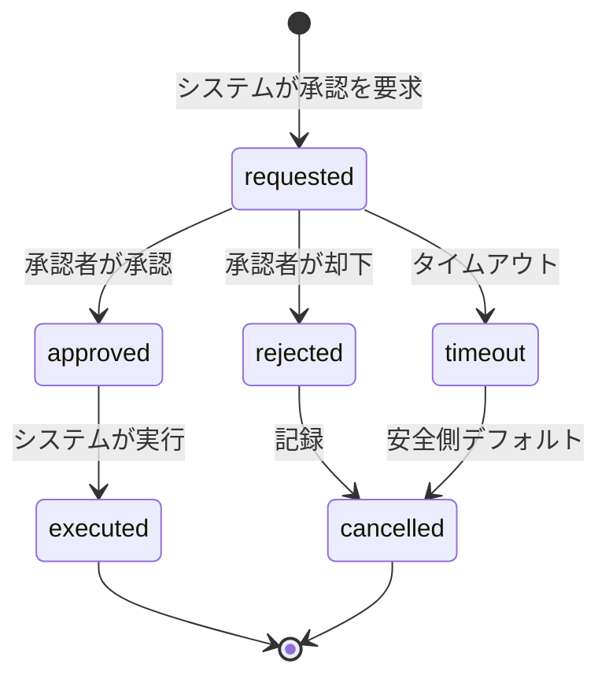

# Agent E: 規制・データインテグリティ・監査の技術的統制

> **Mode A — 設計根拠レポート**  
> 担当: `agent_regulatory_controls`  
> 対象: auto_cell A 層（iPSC 浮遊/凝集体バイオリアクター制御）  
> 前提: R&D / プロセス開発（一次）、Human-on-the-loop、ADR-0001 L0-L3 分離  
> 作成日: 2026-06-16

---

## 1. エグゼクティブサマリ

本レポートは、auto_cell A 層制御システムが **R&D 一次で稼働しつつ、将来の GMP/GCTP 移行を設計段階で排除しない** ための技術的統制を整理したものである。

核心メッセージ:

- **決定的コア（L0/L1）を厚く、LLM（L3）を薄く** することで、R&D 再現性（ALCOA-lite）と監査性を両立する。`〔事実：ADR-0001, kg_to_auto_cell.md §7.2, KG: ctrl_split〕`
- 全副作用ツール呼び出しは **不変監査ログ** へ書き出し、人の承認/却下/タイムアウトを記録する。`〔提案：Part11/ALCOA+ から導出〕`
- **L1 決定的ルール + Tier2 `plant_model`** により、CSV/CSA における回帰検証リグを確保する。`〔事実：kg_to_auto_cell.md §6, KG: csv-validates-loop〕`
- LLM 層（L3）は **GAMP5 Cat.4/5 的な検証**が必要だが、完全な決定性保証は困難なため、**イベント駆動・承認仲介・根拠ログ** に機能を限定し、L0-L1 の安全系を介在させる。`〔推定：GAMP5 2nd Ed Appendix D11〕`
- EBR（電子バッチ記録）は **1 培養ラン = 1 event_store 導出ビュー** とし、R&D 一次では「EBR-like 実験記録」として実装する。`〔提案：将来 GMP EBR への橋渡し〕`

---

## 2. スコープと設計境界

| 項目 | A 層内（本レポート対象） | 設計境界（言及のみ） |
|---|---|---|
| 対象プロセス | iPSC 浮遊/凝集体バイオリアクター（Manstein 型灌流、0→7 vvd） | 樹立（reprog）、分化（diff）、双腕ロボ（dualarm）、接着 2D 培養 |
| 運転形態 | R&D / プロセス開発（一次） | GMP 完全準拠運転、商業製造 |
| 制御層 | L0 局所 PID、L1 決定的レシピ/ルール、L2 BO、L3 薄い LLM | 下位 PLC/FCS ファームウェアの個別認証 |
| 規制 | ALCOA+、Part11/Annex11、CSV/CSA、GAMP5、GCTP（設計境界） | 施設基準（ramlaw）、製造販売承認、臨床試験規制 |
| データ | センサ・画像・操作ログ・承認記録・シミュレーション軌道 | LIMS/ERP/紙帳票の完全統合、外部 ELN |

> `〔事実：requirements.md §5, kg_to_auto_cell.md §1〕`

---

## 3. ALCOA+ 原則の実装対応

ALCOA+ は FDA、MHRA、WHO、PIC/S、EMA/Annex 11 で共通のデータインテグリティ原則である。`〔事実：FDA Data Integrity and Compliance with Drug CGMP Questions and Answers, 2018; MHRA GxP Data Integrity Guidance, 2018; WHO Good Data and Record Management Practice〕`

### 3.1 各原則の技術的対応

| ALCOA+ | 技術的実装方針 | 置き場 / コンポーネント | 確度 |
|---|---|---|---|
| **Attributable（帰属性）** | 全操作に `user_id`（研究者/オペレータ/システム）を付与。共有アカウントは禁止。L1/L2/L3 各層の識別子を区別。 | `tool_executor` の実行ログ、`approval` レコード、MQTT cmd correlation ID | 事実 |
| **Legible（判読性）** | JSON/構造化ログを採用。人間が読める要約（`build_culture_unit_summary`）を併記。長期保存形式は CSV/JSONL/Parquet + スキーマ。 | `event_store`、`audit_log`、HMI ダッシュボード | 事実 |
| **Contemporaneous（同時性）** | 操作発生時に UTC タイムスタンプを生成。NTP 同期を前提。ログは非同期バッファではなく commit 時刻を記録。 | edge/gateway → brain 受信時刻、ツール実行時刻 | 事実 |
| **Original（原本性）** | 生データ（センサ raw、画像、Raman スペクトル）を変更不可ストレージに保存。加工データは元データへの参照を保持。 | `datamodel` 取り込み層、WORM バックアップ | 提案 |
| **Accurate（正確性）** | `validate_tool_call` + sanitizer で範囲/変化率/包絡線を事前検証。センサ値は LADS Function の単位/EU で型付き。 | `CellCulturePlugin.validate_tool_call`、`devprofile` | 事実 |
| **Complete（完全性）** | 失敗/却下/タイムアウトも含め全イベントを保存。操作前後の状態スナップショットを記録。 | `event_store` | 提案 |
| **Consistent（一貫性）** | 同一 run 内で event 順序を causality/timestamp で保証。分散クロックは NTP + vector clock や correlation ID で補完。 | `event_store` 並び順、MQTT5 correlation data | 推定 |
| **Enduring（永続性）** | イミュータブルログ。変更は append-only。バックアップ・レプリカを分離。 | `audit_log` backend、オブジェクトストレージ | 提案 |
| **Available（可用性）** | 保存期間は R&D 一次では最低 run 終了後 5 年を推奨（GMP 移行時は製品ライフサイクル準拠）。検索・エクスポート API を提供。 | `event_store` query API、HMI 監査ビュー | 推定 |

`〔出典：FDA 2018 Data Integrity Guidance, https://www.fda.gov/regulatory-information/search-fda-guidance-documents/data-integrity-and-compliance-drug-cgmp-questions-and-answers; MHRA 2018, https://www.gov.uk/government/collections/mhra-gxp-data-integrity-guidance〕`

### 3.2 auto_cell 固有の注意点

- **L3 LLM 出力の「original」問題**: LLM が生成した要約/根拠文は「二次表現」である。原本性を担保するため、LLM 入力（プロンプト/参照状態/参照ルール）も保存し、出力と紐づける。`〔推定：GAMP5 2nd Ed D11〕`
- **BO（L2）の不確実性記録**: ガウス過程の事後分布や獲得関数値もメタデータとして保存し、なぜその提案が出たかを再構成可能にする。`〔提案〕`
- **シミュレーション軌道の保存**: Tier2 plant_model の入出力を run ごとに保存し、再現性（同一アクチュエータ系列 → 同一センサ軌道）を検証する。`〔事実：ADR-0001, kg_to_auto_cell.md §6〕`

---

## 4. 監査証跡（Audit Trail）

### 4.1 監査対象イベント

| イベント種別 | 例 | 記録内容 | 備考 |
|---|---|---|---|
| **副作用ツール呼び出し** | `set_perfusion_rate`, `set_agitation_rpm`, `feed`, `trigger_passage` | 呼び出し元（L1/L2/L3）、引数、実行前後状態、結果/エラー | 全件必須 `〔事実：kg_to_auto_cell.md §5〕` |
| **承認フロー** | 包絡線外 setpoint 変更、BO 提案採用、passage 実行 | requested → approved/rejected/timeout → executed/cancelled 遷移 | Human-on-the-loop `〔事実：requirements.md FR-4〕` |
| **状態遷移** | `contamination_suspected`、L1 レシピフェーズ遷移 | トリガ条件、遷移前後、ルール ID | 安全/品質に直結 |
| **センサ/画像取り込み** | 生データ到着、異常値フラグ、校正イベント | デバイス ID、channel、生値、EU、timestamp | ALCOA の original/contemporaneous |
| **ユーザー操作** | HMI からの承認/却下/コメント、レシピ変更 | user_id、IP/端末、入力値、コメント | Part11 attributable |
| **システム自己診断** | ブレイン再起動、L0 局所 PID 縮退、通信断 | イベント種別、影響範囲、自動対応 | NFR-R 可用性 |

### 4.2 監査ログスキーマ案

```json
{
  "event_id": "uuid",
  "event_type": "tool_invoke | approval_state_change | sensor_ingest | system_state | user_action",
  "timestamp_utc": "2026-06-16T04:20:31.597Z",
  "source": {
    "layer": "L0|L1|L2|L3",
    "component": "recipe_executor|bayesian_optimizer|llm_orchestrator|tool_executor|sensor_gateway",
    "instance_id": "brain-01"
  },
  "actor": {
    "type": "system|operator|researcher",
    "user_id": "user-uuid",
    "role": "operator|qa|admin"
  },
  "culture_unit_id": "bioreactor-A-001",
  "run_id": "run-2026-06-15-A01",
  "action": {
    "name": "set_perfusion_rate",
    "args": {"vvd": 3.5},
    "pre_state": {"perfusion_rate_vvd": 2.0, "glucose_mM": 1.8},
    "post_state": {"perfusion_rate_vvd": 3.5, "glucose_mM": null},
    "result": "ack|nack|timeout"
  },
  "justification": {
    "rule_id": "glucose_low_perfusion_ramp",
    "llm_prompt_id": null,
    "bo_acquisition_id": null,
    "human_approval_id": "approval-uuid"
  },
  "integrity": {
    "hash": "sha256:...",
    "prev_hash": "sha256:...",
    "signature": "..."
  },
  "context": {
    "correlation_id": "cmd-uuid",
    "mqtt_topic": "cell/bioreactor-A-001/cmd/set_perfusion_rate"
  }
}
```

> `〔提案：Part11 §11.10(e) audit trail、21 CFR Part 11 eCFR 21.11.10(e)〕`

### 4.3 不変性と改ざん防止

- ログストリームは **append-only** とする。`〔事実：ALCOA+ Endurable/Original〕`
- 各イベントに前イベントハッシュを含める（簡易チェーン）。本格的な改ざん防止が必要な場合は、WORM ストレージまたはブロックチェーン/分散台帳を後段で追加可能。`〔推定：GAMP5 2nd Ed D10 分散台帳参照〕`
- 管理者であっても既存ログの削除/上書きは不可。レベルでのアーカイブ移動のみ可。`〔提案：Part11 closed system controls〕`

---

## 5. CSV/CSA 観点からの検証戦略

### 5.1 L0-L3 ごとの検証アプローチ

| 層 | コンポーネント | GAMP5 カテゴリ（推定） | 検証/保証アプローチ | 確度 |
|---|---|---|---|---|
| **L0 デバイス局所** | バイオリアクタ内 PID（温度/pH/DO/撹拌） | Cat.3（ファームウェア）または Cat.4（設定済み） | ベンダ IQ/OQ を活用。設定パラメタを CSV 仕様書に記載。 | 推定 |
| **L1 決定的レシピ/ルール** | `recipe_executor`、ルールエンジン、`validate_tool_call` | Cat.4（設定可能）または Cat.5（カスタムロジック） | 単体テスト + Tier2 plant_model 回帰テスト + 黄金テスト | 事実 |
| **L2 ベイズ最適化** | BoTorch/Ax、獲得関数、多忠実度 | Cat.4/5（設定/カスタム） | 確定的 seed で再現テスト、シミュレーション低忠実度でのスクリーニング、人承認付き提案 | 推定 |
| **L3 LLM オーケストレータ** | 薄い LLM、HMI 仲介、例外処理 | Cat.4/5（特に AI/ML 部品） | プロンプトバージョニング、出力の根拠ログ、非決定性を L0-L1 で抑制 | 推定 |
| **共通基盤** | event_store、audit_log、gateway | Cat.4/5 | データインテグリティテスト、フェイルオーバー/復旧テスト | 推定 |

`〔出典：GAMP5 2nd Ed, https://ispe.org/publications/guidance-documents/gamp-5-guide-2nd-edition; FDA CSA Guidance, https://www.fda.gov/regulatory-information/search-fda-guidance-documents/computer-software-assurance-production-and-quality-system-software〕`

### 5.2 L1 決定的ルールのテスト容易性

- ルールは **宣言的 DSL または状態機械** で記述し、ユニットテスト可能にする。`〔提案：ADR-0001 Follow-ups〕`
- 全ルールは **条件 → アクション → 包絡線拘束** の 3 要素で記述し、カバレッジ計測可能にする。`〔提案〕`
- 例:
  ```yaml
  rule_id: glucose_low_perfusion_ramp
  condition: glucose_mM < 1.5 AND perfusion_rate_vvd < 7.0
  action: set_perfusion_rate(min(perfusion_rate_vvd + 0.5, 7.0))
  envelope: perfusion_rate_vvd in [0, 7.0], delta <= 0.5 vvd/h
  ```

### 5.3 Tier2 plant_model による回帰検証

- `plant_model.step(actuators) -> sensors` は **文献接地プラント**（Manstein 2021）であり、L1 ルールの「同一アクチュエータ系列 → 同一センサ軌道」決定性を CI で検証する。`〔事実：kg_to_auto_cell.md §6, sim/plant_model/__init__.py〕`
- ゴールデンテスト: 7 日 35×10⁶ cells/mL 到達軌道を固定 seed/固定アクチュエータ系列で再現。`〔提案〕`
- 変更影響範囲: L1 ルール変更時は plant_model 回帰テストを必須化。`〔提案〕`

`〔出典：Manstein et al. 2021, PMID 33660952 / PMC8666714, src_manstein〕`

### 5.4 LLM 層（L3）の検証戦略

LLM の非決定性は CSV/CSA の観点で最大の課題である。

- **L3 は判断要時のみ起動**（ADR-0001）。定常制御は L1 で決定的に動作するため、LLM の影響範囲を限定。`〔事実：ADR-0001〕`
- **プロンプトバージョニング**: 使用プロンプト（system prompt、tool descriptions、状態要約）を Git 管理し、再現性を担保。`〔提案〕`
- **出力根拠の追跡**: LLM が出した提案は、参照した状態・ルール・履歴をメタデータに保持。`〔提案〕`
- **非決定性の抑制**: temperature=0、seed 固定、決定的 decoding を使用。それでも再現性は保証されないため、**L3 出力は必ず L1/L2 の検証済み包絡線/ルールを通す**。`〔推定：GAMP5 2nd Ed D11 AI/ML〕`
- **GAMP5 分類**: L3 の LLM 部品は Cat.5（カスタム AI/ML）として扱い、モデル性能モニタリング、プロンプト変更管理、運用監視を義務付ける。`〔推定：GAMP5 2nd Ed D11〕`

---

## 6. Part 11 / GAMP5(AI) 観点

### 6.1 21 CFR Part 11 / EU Annex 11 の適用範囲

- R&D 一次では **Part11/Annex11 完全準拠は hard 制約ではない**（requirements.md §3）。ただし、**電子記録・電子署名の技術的統制を設計に組み込む**ことで、将来の GMP 移行コストを下げる。`〔事実：requirements.md §3, §5〕`
- 適用対象: 操作ログ、承認記録、EBR-like 実験記録、品質関連 offline データ。`〔推定：Part11 predicate rules 絞込〕`

`〔出典：21 CFR Part 11, https://www.ecfr.gov/current/title-21/chapter-I/subchapter-A/part-11; EudraLex Annex 11, https://health.ec.europa.eu/document/download/2c252435-6383-4ced-8206-8fef57024cc1_en〕`

### 6.2 電子署名の必要性

| アクション | R&D 一次 | 将来 GMP | 実装方針 |
|---|---|---|---|
| 包絡線内自律実行 | システム署名（service identity）で十分 | 不要（自動化） | `actor.type=system` + 改ざん防止ハッシュ |
| 包絡線外 setpoint 変更 | 研究者承認（PIN/パスフレーズ） | 電子署名必須 | `approval` レコードに user_id + credential + meaning |
| passage 実行 | 研究者承認必須 | 電子署名必須 | 同上 + 実行後 second-person review 推奨 |
| BO 提案採用 | 研究者承認 | 電子署名必須 | 提案内容 + 採用理由をバインド |
| 緊急停止/ホールド | 安全系が強制、HMI 操作者を記録 | 電子署名推奨 | 操作ログ + 自動 safety lock 記録 |

> `〔提案：21 CFR Part 11 Subpart C §11.50, §11.70, §11.200〕`

### 6.3 GAMP5 ソフトウェアカテゴリ分類（案）

| コンポーネント | カテゴリ | 根拠 | 確度 |
|---|---|---|---|
| OS/DB/ネットワーク/MQTT broker | Cat.1 | インフラ | 事実 |
| 商用 OPC-UA/LADS スタック、SiLA2 SDK | Cat.3 | 設定変更なしで使用 | 推定 |
| auto_cell core（physical-ai-core 改修含む） | Cat.5 | カスタム開発、製造判断に影響 | 推定 |
| `CellCulturePlugin` ルール/包絡線設定 | Cat.4 | 設定可能な業務ロジック | 推定 |
| L2 BO エンジン（Ax/BoTorch ラッパー） | Cat.4/5 | 設定+カスタム目的関数 | 推定 |
| L3 LLM オーケストレータ | Cat.5（AI/ML） | GAMP5 2nd Ed D11 対象 | 推定 |
| event_store / audit_log | Cat.4/5 | 電子記録の完全性に直結 | 推定 |

`〔出典：ISPE GAMP 5 Guide 2nd Edition, July 2022, https://ispe.org/publications/guidance-documents/gamp-5-guide-2nd-edition〕`

### 6.4 GAMP5 AI/ML 対応

- GAMP5 2nd Ed Appendix D11 は AI/ML システムの検証を扱う。`〔事実〕`
- ISPE GAMP Guide: Artificial Intelligence（2025 年 7 月発行）は、AI 有効化コンピュータ化システムのライフサイクル全体の検証枠組み。`〔事実〕`
- 重要ポイント:
  - **Intended Use の明確化**: L3 LLM は「曖昧な知覚解釈・例外処理・HMI 仲介」に限定。`〔事実：ADR-0001〕`
  - **Data Governance**: 訓練/テストデータの出所、バージョン、適用範囲を記録。A 層では LLM ファインチューニングを想定しないが、プロンプト/ Few-shot 例のバージョン管理を行う。`〔推定：GAMP AI Guide〕`
  - **Human Oversight**: LLM 提案は人の承認または L1 ルールを通す。完全自動承認は避ける。`〔事実：requirements.md Human-on-the-loop〕`
  - **Performance Monitoring**: LLM 出力の異常（ハルシネーション、想定外 tool call）を検知し、CAPA フックへ。`〔提案：GAMP5 D11〕`

`〔出典：ISPE GAMP Guide: Artificial Intelligence, 2025, https://ispe.org/publications/guidance-documents/gamp-guide-artificial-intelligence〕`

---

## 7. EBR（電子バッチ記録）

### 7.1 1 培養ラン = 1 EBR

- 1 培養ランは `run_id` で識別し、`event_store` から以下を導出する。`〔提案：kg_to_auto_cell.md §5〕`
  - 開始: seeding/接種時刻、初期条件（培地、播種密度、デバイス ID）
  - 経過: センサ時系列、CPP 逸脱イベント、L1 ルール発火履歴、承認記録
  - 操作: 全副作用ツール呼び出しとその結果
  - 終了: 継代/回収時刻、最終 VCD、offline QC 結果（あれば）

### 7.2 R&D 一次での EBR-like 実装

- GMP EBR と区別し、**「実験プロビナンスレポート」** と呼ぶ。`〔提案〕`
- 必須要素:
  - run 開始時のパラメタ（レシピ ID、BO 計画、目標密度）
  - 全操作の監査証跡
  - 全センサ/分析データへの参照
  - 逸脱・イベント・CAPA 記録
  - 終了時のサマリー（収量、生存率、品質指標）
- 出力形式: Markdown/PDF + 構造化 JSON（機械可読）。`〔提案〕`

### 7.3 将来 GMP 移行時のギャップ

| 項目 | R&D 一次（EBR-like） | 将来 GMP EBR | ギャップ |
|---|---|---|---|
| 電子署名 | PIN/パスフレーズレベル | Part11/Annex11 完全準拠 | 署名の法的等価性 |
| 承認ワークフロー | 研究者承認 | QA 承認 + second-person check | 役割分離 |
| レビュー | 研究者が任意 | 定期的な audit trail review SOP | SOP/トレーニング |
| 保存期間 | run 後 5 年推奨 | 製品ライフサイクル準拠 | 保持ポリシー |
| システム検証 | CSA 軽量 | CSV 完全 + IQ/OQ/PQ | 文書化レベル |
| データ完全性 | ALCOA-lite | ALCOA+ 完全 | WORM/改ざん防止 |

---

## 8. 技術的統制一覧（規制要件 → 実装方針 → 置き場）

| 規制/原則 | 設計要件 | 実装方針 | 置き場 | 確度 |
|---|---|---|---|---|
| ALCOA+ Attributable | 全操作の user_id 付与 | JWT/アクセストークン + ロールベースアクセス制御 | core auth / `tool_executor` | 事実 |
| ALCOA+ Legible/Original | 生データの構造化保存 | JSONL/Parquet + スキーマレジストリ | `datamodel` / object storage | 提案 |
| ALCOA+ Contemporaneous | NTP 同期 timestamp | UTC + デバイス側生成時刻の両方保持 | edge/gateway / `event_store` | 事実 |
| ALCOA+ Enduring | append-only ログ | ハッシュチェーン + WORM バックアップ | `audit_log` backend | 提案 |
| Part11 §11.10(e) | 自動監査証跡 | 全副作用ツール・承認状態を構造化ログ化 | `audit_log` | 事実 |
| Part11 §11.50/70/200 | 電子署名のバインド | approval レコードに署名要素（user_id、timestamp、meaning）を付与 | `approval` service | 提案 |
| CSV/CSA | リスクベース検証 | L1 ルール単体テスト + plant_model 回帰テスト | CI / `tests/` | 事実 |
| GAMP5 Cat.4/5 | カスタム/設定ソフトの検証 | URS → FS/DS → テスト → リリース管理 | バリデーションパッケージ | 推定 |
| GAMP5 D11 AI/ML | LLM 部品の管理 | プロンプトバージョニング、出力根拠ログ、性能モニタリング | L3 module | 推定 |
| CAPA | 逸脱検知 → 是正処置 | `contamination_suspected` 等を CAPA フックへ、audit レビュー定期実施 | `detect_events` / QA SOP | 事実 |
| GCTP（設計境界） | 再生医療製品製造管理の適合 | A 層ソフトとしては技術的統制を設計に織り込む。完全適合はプログラム全体の責務。 | 設計要件書 | 事実 |

---

## 9. Human-on-the-loop 承認フローと監査

### 9.1 承認が必要なアクション

| アクション | トリガ | 承認者 | タイムアウト時のデフォルト | 確度 |
|---|---|---|---|---|
| 包絡線外 setpoint 変更 | `validate_tool_call` 失敗 | 研究者/オペレータ | 却下（安全側） | 事実 |
| `trigger_passage` | `vcd_target_reached` または `aggregate_out_of_range` | 研究者 | 保留（継代を先延ばし、安全アラート） | 推定 |
| BO 提案採用（包絡線外 or 重大） | L2 → L3 承認要求 | 研究者 | 却下（現行維持） | 事実 |
| 緊急停止 / ホールド | 汚染疑い/安全系異常 | 安全系が強制、HMI 操作者記録 | 自動安全動作 | 事実 |
| レシピ変更 | 新規条件探索 | QA/研究者 | 却下 | 推定 |

`〔事実：requirements.md FR-4, kg_to_auto_cell.md §7.2〕`

### 9.2 承認状態遷移



- 全遷移を `approval_log` に記録。`〔提案〕`
- 承認に際しては **meaning（Approved/Reviewed/Authored）** を明示（Part11 §11.50）。`〔提案〕`

---

## 10. R&D 一次 vs 将来 GMP のギャップ分析

| 観点 | R&D 一次の目標 | 将来 GMP で追加が必要なもの | 実装段階 |
|---|---|---|---|
| 電子署名 | PIN/パスフレーズ | 21 CFR Part11/Annex11 完全署名 | 後段 |
| 監査証跡 | 構造化ログ + 簡易ハッシュ | WORM + 定期レビュー SOP | v1 で基盤、後段で強化 |
| CSV/CSA | リスクベース軽量保証 | IQ/OQ/PQ 文書、完全トレーサビリティ | v1 で回帰テスト、後段で文書化 |
| LLM 検証 | プロンプト管理 + 根拠ログ | GAMP AI Guide 準拠のモデル管理 | v1 で設計、後段で formalize |
| EBR | EBR-like 実験記録 | GMP EBR + QA 承認 + 長期保存 | v1 で導出ビュー、後段で移行 |
| ロール分離 | 研究者/オペレータ/システム | QA/製造/QC の明確な役割分離 | 後段 |
| データアーカイブ | run 後 5 年推奨 | 製品ライフサイクル + リコール対応 | 後段 |

---

## 11. 未確定事項・要追加調査

1. **電子署名方式**: R&D 一次で使用する認証基盤（IdP）と、将来 Part11 署名への移行方式。`〔未確定〕`
2. **ログ保存インフラ**: オブジェクトストレージ vs RDB vs 専用 audit DB の選定、コスト見積。`〔未確定〕`
3. **LLM 非決定性の定量化**: temperature=0 + seed 固定でも再現しないケースの許容基準。`〔未確定：GAMP AI Guide 参照〕`
4. **offline QC データの取り込み**: BO 目的関数に入る品質指標のデータモデル。`〔未確定：P5 #11 品質 open〕`
5. **無菌/汚染 online 検知**: 閉鎖系 iPSC で有効な online/rapid 無菌検知手段の確認。`〔未確定：P5 #17 無菌 open〕`
6. **GCTP 適用範囲の具体化**: A 層ソフトが満たすべき GCTP 技術要件（MHLW Notification No.93 等）の条文レベル展開。`〔未確定：設計境界〕`

---

## 12. トレーサビリティ

| 設計要素 | 参照 KG ノード | 参照ソース |
|---|---|---|
| ALCOA+ 技術的統制 | `alcoa`, `datamodel`, `audit`, `ebr` | src_fda_data_integrity, src_cgt |
| 監査ログ | `audit`, `loop`, `tool_executor` | 21 CFR Part 11 §11.10(e) |
| 承認フロー | `loop`, `ctrl_split`, `capa` | requirements.md FR-4 |
| CSV/CSA | `csv`, `kinetics`, `loop` | src_manstein, FDA CSA Guidance |
| Part11/電子署名 | `part11`, `ebr`, `audit` | 21 CFR Part 11 eCFR |
| GAMP5/AI | `csv`, `sdl`, `loop` | ISPE GAMP5 2nd Ed, GAMP AI Guide |
| EBR | `ebr`, `lims`, `datamodel` | src_cgt, EudraLex Annex 11 |
| GCTP 境界 | `gctp`, `ramlaw`, `qccrit` | src_gctp, PMDA |

---

## 13. 出典一覧

| ID | タイトル | URL/DOI/PMID/PMCID |
|---|---|---|
| `src_fda_data_integrity` | FDA Guidance for Industry: Data Integrity and Compliance With Drug CGMP Questions and Answers (2018) | https://www.fda.gov/regulatory-information/search-fda-guidance-documents/data-integrity-and-compliance-drug-cgmp-questions-and-answers |
| `src_part11` | 21 CFR Part 11 — Electronic Records; Electronic Signatures | https://www.ecfr.gov/current/title-21/chapter-I/subchapter-A/part-11 |
| `src_fda_csa` | FDA Guidance: Computer Software Assurance for Production and Quality System Software (2022 draft / 2025 final) | https://www.fda.gov/regulatory-information/search-fda-guidance-documents/computer-software-assurance-production-and-quality-system-software |
| `src_gamp5` | ISPE GAMP 5 Guide: A Risk-Based Approach to Compliant GxP Computerized Systems, Second Edition (2022) | https://ispe.org/publications/guidance-documents/gamp-5-guide-2nd-edition |
| `src_gamp5_ai` | ISPE GAMP Guide: Artificial Intelligence (2025) | https://ispe.org/publications/guidance-documents/gamp-guide-artificial-intelligence |
| `src_annex11` | EudraLex Volume 4 Annex 11 — Computerised Systems | https://health.ec.europa.eu/document/download/2c252435-6383-4ced-8206-8fef57024cc1_en |
| `src_pics041` | PIC/S PI 041-1 — Good Practices for Data Management and Integrity in Regulated GMP/GDP Environments (2021) | https://picscheme.org/en/publications |
| `src_who_gdrp` | WHO Good Data and Record Management Practice | https://www.who.int/teams/regulation-prequalification/regulation-and-safety/good-data-and-record-management-practice |
| `src_cgt` | Cell & Gene Therapy QC/QA（ALCOA, Part 11, CAPA） | https://www.cellandgene.com/topic/cell-gene-therapy-qa-qc |
| `src_gctp` | PMDA GCTP 適合性調査 | https://www.pmda.go.jp/review-services/gmp-qms-gctp/gctp/0002.html |
| `src_manstein` | Manstein et al. 2021, Stem Cells Transl Med 10(7):1063-1080 / STAR Protocols 2(4):100988 | PMID 33660952 / PMC8666714 |
| `src_lads` | OPC UA for LADS Part 1 Basics (OPC 30500-1) | https://reference.opcfoundation.org/LADS/v100/docs/ |

---

## 14. 用語と確度ラベル

- `〔事実〕`: 既存 KG、設計文書、一次規制ガイダンスに基づく確立した事実。
- `〔提案〕`: 上記から導出した設計提案。実装時に検討・調整が必要。
- `〔推定〕`: 規制解釈や将来技術に関する現時点の推定。別途検証が必要。
- `〔未確定〕`: 現時点で結論が出せない事項。調査継続対象。
- `〔設計境界〕`: A 層スコープ外の事項。本レポートでは言及のみ。
