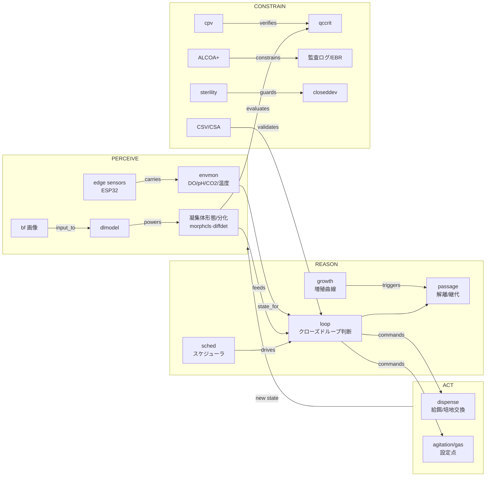

# KG → auto_cell 設計ブリッジ

`docs/knowledge_graph/` のナレッジグラフ（research SoT, 68 ノード/139 エッジ/8 ドメイン）を、
auto_cell の実装構造（`physical_ai_core.DomainVertical` ABC・ReAct ループ・Tier2 plant_model）に
落とし込むための橋渡し文書。

- **KG はそのまま設計図ではない。** KG はドメイン知識の網羅で、対象は「iPS 自動培養ソフトウェア
  全体」（樹立→維持→分化→QC、双腕も含む）。auto_cell の責務は **A 層（バイオリアクタープロセス
  制御・iPSC 浮遊/凝集体量産）** に限定（README）。本書はまず **スコープ写像**で KG を A 層に射影し、
  そのうえで各ノードを ABC slot・制御変数・規制制約へ割り付ける。
- 表記: 各設計主張の末尾 `(KG: <node_id>)` は KG ノードへの参照（`knowledge_graph.json` の `id`）。
  `〔事実〕` = KG/コードが確立済 / `〔提案〕` = 本書が KG から導いた設計 / `〔要決定〕` = 未決の判断。

---

## 1. スコープ写像 — 8 ドメイン → A 層

KG の 8 ドメインを auto_cell（A 層）の責務へ射影する。**A 層に入るのは「閉鎖系バイオリアクタ内の
浮遊/凝集体培養を連続制御する」部分のみ。** 接着 2D・双腕汎用ロボ・樹立工程は対象外だが、
WorldModel の文脈やパートナ選定では参照する。

| KG ドメイン | A 層での扱い | 主な根拠ノード |
|---|---|---|
| **d1 細胞生物学・培養プロトコル** | **中核（選択的）**: `suspension`(浮遊量産)・`maint`(維持) が直接の制御対象。`passage` は浮遊では希釈/解離継代として部分的。`qccrit` は受入基準＝イベント/バリデーションの「正解」。`reprog`(樹立)・`diff`(分化)・`signal`(添加因子) は上流/下流で **runtime 外**（文脈・将来の最適化対象）。`feeder` は浮遊の前提条件。 | suspension, maint, qccrit, passage |
| **d2 画像取得・CV** | **部分的**: 浮遊では古典的 `conf`(コンフルエンシー) は接着 2D 指標で **B 層寄り**。A 層に効くのは **凝集体サイズ/形態**（`morphcls`/`diffdet` を凝集体メトリクスへ読み替え）。画像は `route_perception` 経由で `perception.domain_data` に入れる。 | morphcls, diffdet, dlmodel, bf |
| **d3 ロボティクス・液体ハンドリング** | **部分的**: `closeddev`(閉鎖型専用機)＝制御対象のバイオリアクタ本体、`dispense`(分注)＝給餌/培地交換アクチュエータ＝ **in**。`dualarm`/`transport`/`motioncap` は接着・汎用ラボ自動化＝ **out**。 | closeddev, dispense |
| **d4 プロセス制御・自律最適化** | **中核**: `sched`+`loop` が ReAct ループそのもの＝ **in**。`bbo`/`doe`/`sdl` は CPP/設定点の **オフライン最適化メタループ**（Tier2・将来）。`rl` は研究段階（GMP の検証性が壁, KG 記載）＝ out。 | sched, loop, bbo, doe |
| **d5 ソフト基盤・相互運用** | **基盤（infra/Tier1）**: `sila`/`opcua`/`gateway` がデバイス IF、`orch` がスケジュール宿主、`lims`/`datamodel` がデータ層。auto_cell は core の `device_registry`／`infra/virtual_edge` の背後にこれを置く。 | sila, opcua, gateway, datamodel |
| **d6 GMP・規制・データインテグリティ** | **横断制約**: 設計境界を規定。`validate_tool_call`・sanitizer・監査ログ・EBR の **技術的統制**として実装に織り込む（フル準拠はプログラム全体の責務）。 | alcoa, part11, audit, csv, gctp |
| **d7 センサ・環境モニタリング** | **中核**: `envmon`(DO/pH/CO₂/温度) が `channel_config` の主役、`sterility` がイベント、`cpv` が at-line QC、`edge`(ESP32) が Tier1 結線。 | envmon, sterility, cpv, edge |
| **d8 エコシステム・プレイヤー** | **参照（runtime 外）**: 技術選定・build/buy・IF ターゲットの地図。`closeddev` 系（CiRA/Terumo/Panasonic）を HW 抽象のターゲットに、双腕系（Maholo/Astellas）は対象外と確認。 | cira, terumo, pana, kaneka |

---

## 2. 制御ループ写像 — KG クロスエッジ = ReAct ループ

KG の `contains`/`has` 以外の **typed edge（動詞）はそのまま制御依存方向**。

> ⚠️ **制御構造は ADR-0001 で改訂**（[`adr/0001-control-architecture.md`](adr/0001-control-architecture.md)）。
> 下図の「ReAct ループ（毎周期 LLM が perceive→reason→act）」は **A 層制御の中心としては却下**。採用は
> **L0/L1 決定的制御＋L2 ベイズ最適化＋L3 薄い LLM オーケストレータ（非常駐・イベント駆動）**。以下の図は
> *知覚→判断→実行の依存方向*（どのデータがどのアクションを駆動するか）の参照として読む（LLM が毎周期
> reason する意味ではない）。`loop` ノードは L1 決定的監督制御＋（必要時）L3-LLM と読み替える。

これを依存方向として重ねると、KG が制御の流れをほぼそのまま記述していることがわかる
（perceive→reason→act の各相は下表; cadence/権限は §7.2・ADR-0001）。



ループ各相と core の対応:

| 相 | 役割 | core / ABC 上の置き場 | KG ノード |
|---|---|---|---|
| **perceive** | センサ＋画像を WorldModel へ | `route_channel` → `domain_envs["cell_culture"]`、`route_perception` → `perception.domain_data` | envmon, edge, dlmodel, morphcls, diffdet |
| **reason** | 状態→判断（給餌/交換/撹拌/継代/サンプル/通知） | LLM + `system_prompt_section` + `build_culture_unit_summary` + `detect_events` | loop, sched, growth, conf |
| **act** | アクチュエータ呼び出し | `tool_schemas` / `tool_handlers` | dispense, closeddev, passage |
| **speak** | アラート/通知（レート制限） | sanitizer + `suppression_defaults` | loop, capa |
| **constrain** | 安全包絡線＋規制 | `validate_tool_call` + sanitizer + 監査ログ | alcoa, part11, csv, audit, sterility |

**設計上重要なエッジ**:
- `growth --triggers--> passage` 〔事実: KG〕: 増殖曲線予測が継代の起点。→ `detect_events` で `vcd_target_reached` を出し、`loop` が `trigger_passage` を判断する閉ループの中心。
- `csv --validates--> loop` 〔事実: KG〕: **制御ループ自体が CSV/CSA 検証対象**。→ ループは決定的・テスト可能であるべき。Tier2 `plant_model` がその検証リグ（§6）。
- `alcoa --constrains--> {audit, ebr, datamodel}` 〔事実: KG〕: 全データ取り込み・全操作ログが ALCOA+ に従う。→ `tool_handlers` の副作用は監査可能ログ必須（§5）。

---

## 3. DomainVertical プラグイン設計面（KG concept → ABC slot）

`CellCulturePlugin(DomainVertical)` の各 slot に KG ノードを割り付けた **提案**。slot 名は
`physical-ai-core/.../plugin_base.py` の実シグネチャ。

| ABC slot | 提案内容 | 由来 KG |
|---|---|---|
| `domain_id` / `display_name` | `"cell_culture"` / `"細胞培養（iPSC 浮遊）"` 〔提案〕 | root |
| `culture_unit_field_name()` | `"cell_culture"`（`domain_envs` / `perception.domain_data` のキー）〔提案〕 | — |
| `applicable_zone_types()` | `{"suspension_bioreactor"}` ✅決定（§8#4: 撹拌槽/Vertical-Wheel は device 属性、gate は抽象プロセス形態） | suspension, closeddev |
| `environment_model()` | `CellCultureEnv`(BaseModel): VCD, viability, glucose, lactate, glutamine, ammonia, pH, DO, CO₂, temp, osmolality, agitation_rpm, aggregate_diameter_um, **perfusion_rate_vvd**, culture_age_d, phase。CPP は §4。 | maint, suspension, envmon, signal |
| `channel_config()` | 連続計測チャネル（§4 の channel 列）。`do`/`ph`/`lactate` は半減期・トレンド閾値を個別調整。**凝集体径は device/分析器が算出した analog channel**（§8#3）。 | envmon, edge, cpv |
| `route_channel()` | チャネル→`CellCultureEnv` フィールドへ書込。対象外は False。 | edge, envmon |
| `route_perception()` | **Phase 1 は不要・後段**（§8#3）。凝集体径は analog channel で取得。raw 画像→DL（morphcls/diffdet）を自前処理する段階で実装。古典 confluency は不採用（接着指標）。 | morphcls, diffdet, dlmodel |
| `detect_events()` | §4 のイベント列（do_low, lactate_high, glucose_low, aggregate_out_of_range, vcd_target_reached, contamination_suspected, osmolality_high）。 | sterility, qccrit, growth, cpv |
| `event_descriptions()` / `suppression_defaults()` | 各イベントの日本語説明＋抑制窓（例: do_low=300s, contamination_suspected=0 即時）。 | capa, sterility |
| `tool_schemas()` / `tool_handlers()` | 副作用ツール: **`set_perfusion_rate(vvd)`**（主レバー §7.2）, `set_agitation_rpm`, `feed`, `exchange_media`, `set_gas_setpoint(DO)`, `trigger_passage`(method=dissociate 既定, rock_inhibitor=Y-27632), `take_sample`, `adjust_setpoint`。各々 LADS controller Function/method に対応（§7.3）。 | dispense, closeddev, passage, signal |
| `query_tool_names()` | 読み取り専用（レート制限バイパス）: `get_culture_unit_status`, `get_recent_trend`, `get_cpp_envelope`。 | loop |
| `validate_tool_call()` | CPP 包絡線（min/max）＋ **変化率制限**（シア/浸透圧ショック回避, `passage` のシアストレス管理）＋検証済設定点外への変更禁止。 | passage, csv, qccrit |
| `system_prompt_section()` | iPSC 浮遊培養の制御方針・CPP 目標・継代基準・無菌優先を LLM に注入。 | suspension, maint, qccrit |
| `build_culture_unit_summary()` | 現在の CPP 値・トレンド・凝集体サイズ・培養日数・直近イベントを要約。 | loop, envmon |
| `exposed_env_properties()` | `{"lactate_status", "do_status", "aggregate_status", "passage_readiness"}` 等の計算済プロパティ。 | qccrit, growth |
| `on_init()` / `background_tasks()` | 起動時 CPP 包絡線ロード／定期 at-line サンプリングのスケジュール。 | sched, cpv |

> **参照実装**: プラグイン docstring 記載どおり auto_JA hydroponics（液系 pH/DO/温度/流量）が
> 最も近い類型。継代・凝集体・無菌・規制の 4 点が細胞培養固有の追加。

---

## 4. CPP / 制御変数カタログ

A 層の Critical Process Parameter。**まずは固定の検証済設定点で出荷し（CSV）、BBO による最適化は後段**〔提案〕。

> ✅ **下表「plant 定数」列は文献照合済で忠実**（P1 続報, 2026-06-14）。原典は **Manstein & Zweigerdt
> 2021**（§6, KG: `kinetics`/`src_manstein`）。6 定数すべて一致、検証軌道（35e6/DO40→10/pH7.1）も一致。
> ⚠️ 前ターンで暫定的に原典と推定した Galvanauskas 2019 は**別の近縁 3 項モデル**で、これは誤りだった（§4.1）。

| 変数 | 目標/範囲 | channel | アクチュエータ(tool) | イベント | KG | plant 定数（Manstein 2021, Table 1） |
|---|---|---|---|---|---|---|
| pH | 7.1 | `ph` | CO₂/塩基添加 `set_gas_setpoint` | `ph_out_of_range` | envmon | 設定点 7.1 ✓ |
| DO | 40 %（高密度で→10%） | `do` | スパージ/撹拌 `set_gas_setpoint`,`set_agitation_rpm` | `do_low` | envmon | DO 40→10% ✓ |
| 撹拌 | 50–120 rpm | `agitation` | `set_agitation_rpm` | `shear_risk` | passage, borys | 80 rpm@150mL ✓（VW は最適40-60, borys） |
| 乳酸 | < 50 mM | `lactate`(at-line) | 培地交換/灌流 `exchange_media` | `lactate_high` | suspension, cpv | KLac=50 mM ✓ |
| グルコース | > 1.5 mM | `glucose` | 給餌/灌流 `feed` | `glucose_low` | maint, kinetics | KGlc=1.5 mM ✓ |
| グルタミン | > 0.01 mM | `glutamine` | `feed` | `glutamine_low` | maint, kinetics | KGln=0.01 mM ✓ |
| 浸透圧 | < 500 mOsm | `osmolality` | 灌流 `exchange_media` | `osmolality_high` | suspension, kinetics | KOsm=500 mOsm/kg ✓ |
| 凝集体径 | 150–350 µm | `aggregate_diameter_um`(画像) | 撹拌/解離 `trigger_passage` | `aggregate_out_of_range` | suspension, borys | KAgg=350/2=175 µm（径）✓ |
| VCD | 目標到達で継代（~35×10⁶/mL, 灌流） | `vcd`(キャパシタンス) | `trigger_passage` | `vcd_target_reached` | growth→passage, kinetics | µ=1.35/d ✓ |
| **灌流率** | 0→7 vvd（条件起動） | `perfusion_rate`(actuator/状態) | `set_perfusion_rate` | （glucose/lactate/osmolality トリガ） | manstein | Table 3: 0-7 vvd ✓ |
| 温度 | 37 ℃ | `temp` | ヒータ | `temp_out_of_range` | envmon | 37 ℃ ✓ |
| 無菌性 | 逸脱ゼロ | `sterility`(event) | （停止/隔離 → CAPA） | `contamination_suspected` | sterility→capa | — |

`trigger_passage` v1 = **解離継代**（§8#6）: aggregate→単一細胞/小クランプに解離し目標密度で再播種、凝集体径を
リセット。解離時 ROCK 阻害剤 Y-27632 添加・シアストレス管理が品質を左右する (KG: passage) →
`validate_tool_call` が解離強度の上限と Y-27632 同時添加を強制〔提案〕。密度の微調整は灌流/希釈（別レバー §7.2）。

### 4.1 plant_model 定数の文献照合（✅ 忠実 — 原典は Manstein 2021）

**原典**: **Manstein, Ullmann, Triebert & Zweigerdt 2021**:
- Stem Cells Transl Med 10(7):1063-1080, "High density bioprocessing of hPSC by metabolic control and
  in silico modeling"（DOI 10.1002/sctm.20-0453, PMID 33660952）— primary research。
- STAR Protocols 2(4):100988（DOI 10.1016/j.xpro.2021.100988, PMC8666714）— in silico モデルの **Table 1**。

hPSC **灌流**撹拌槽培養を Monod 型 in silico モデルで制御し、7 日で **70 倍・35×10⁶ cells/mL**
（150 mL で 52.5 億細胞）を達成。pH/DO/glucose/lactate/glutamine に加え **osmolality ピーク抑制**まで
含む 6 項モデルで、plant_model の定数・検証軌道とすべて一致する:

| 定数 | plant_model | 原典 Manstein 2021 (Table 1) | 判定 |
|---|---|---|---|
| µ | 1.35 /day | 1.35 /d⁻¹ | ✅ 一致 |
| K_Glc | 1.5 mM | 1.5 mM | ✅ 一致 |
| K_Lac | 50 mM | 50 mM | ✅ 一致 |
| K_Gln | 0.01 mM | 0.01 mM | ✅ 一致 |
| K_Osm | 500 mOsm | 500 mOsm/kg | ✅ 一致 |
| K_Agg | 175 µm（径） | 350/2 µm ＝ 175 µm（**径**） | ✅ 一致（体積誤読ではない） |

検証軌道（7 日 35×10⁶ cells/mL、DO 40→10%、pH 7.1）も Manstein の実測過程そのもの → **plant_model は
忠実で定数変更は不要**。これは「灌流」プロセス前提の値で、標準バッチでは到達しない（Nogueira/Olmer は
2.3-2.4×10⁶, KG: `src_traj`）→ Tier2 plant も灌流入力を持つ前提で実装する。

> **前ターンの訂正**: deep-research（P1 本調査）は近縁の Galvanauskas 2019（3 項のみ: glucose+lactate+
> aggregate、グルタミン/浸透圧なし、µmax≈2.35/d）を原典と誤推定し「要修正」と判定した。続報の WebFetch で
> Manstein 2021 Table 1 が 6 定数すべて完全一致と判明し、判定は **逆転（忠実・修正不要）**。教訓: 敵対的
> 検証は「Galvanauskas という別モデルの性質」を正しく確認したが、「それが plant_model の原典である」という
> 前提自体が誤りだった。Galvanauskas は KG では近縁モデル `src_galv` として保持。
>
> **決定 #7（§8）の帰結**: 「(a) 原典値に揃える」は **適用不要**。plant_model は既に真の原典 Manstein に
> 一致しており、Galvanauskas 値へ変えるとむしろ正しいモデルを壊す。残る作業は docstring の出典明記のみ（実施済）。

### 4.2 観測性スタック — 各 CPP/品質を何で測れるか（P5, 2026-06-15）

deep-research（計測/分析サーベイ）＋一次検証。詳細・出典は
[`../knowledge_graph/research/2026-06-15_P5_observability.md`](../knowledge_graph/research/2026-06-15_P5_observability.md)。
**閉ループ可（in-line/at-line・低遅延）と BO 目的関数専用（offline・run 単位）を区別**して ICD の sensor Function 候補にする。

**A. 閉ループに使える** — L1/L2 のフィードバック源:

| CPP | 手法/機器 | 配置 | cadence | 留保 |
|---|---|---|---|---|
| VCD/biomass | **capacitance/誘電分光**（Aber FUTURA, Hamilton Incyte Arc） | in-line | ~30s, Modbus 直結 | ✅**Manstein 500mL iPSC で offline VCD と一致**（定性, R²なし）。生細胞特異。iPSC 校正必須 |
| glucose/lactate/gln | **in-line Raman** | in-line | ~1/min | CHO で PID 閉ループ glucose 制御実証。iPSC 再校正必須 |
| 代謝物16項＋osmolality＋viability＋細胞径 | **Nova BioProfile FLEX2** | at-line | ~4.5min | マルチパラメータ。Raman 校正・BO 入力 |
| 凝集体径 | Ovizio iLINE-F PRO(DHM) / FBRM(G400, **CLD≠径**) ／代替: at-line 画像(Kropp/FlowCam) | in-line〜at-line | 連続〜**24h** | turnkey な iPSC 実証 in-line なし → **v1 は at-line 画像/FBRM プロキシ寄り** |
| pH/DO/温度 | 標準プローブ | in-line | 連続 | L0 局所 PID |

**B. BO 目的関数専用**（offline/run 単位・閉ループ不可）: 未分化/多能性マーカー(OCT4/SOX2/NANOG/SSEA/TRA)・
核型/同一性・自発分化（ラベルフリー画像 DL は将来余地）・無菌/汚染。⚠️「offline 限定」は確証 claim 不在に基づく**推定**
（低遅延手段の不在を証明したものではない → #11/#17 で別途調査）。

**設計含意**:
- VCD の **in-line capacitance** が灌流レバー閉ループの anchor（Manstein で iPSC 検証済）。§4 の VCD channel を裏付け。
- 代謝物は **in-line Raman（閉ループ）＋ at-line Nova（リッチ panel）** の二段。
- **凝集体径は in-line が弱い** → §8#3「analog channel」は維持だが **cadence は at-line 寄り（連続でない）** を前提に L1 を設計。
- **品質/無菌が offline＝BO 側**である事実は **ADR-0001 の L1(物理 CPP の決定的制御)/L2(BO は run 結果の品質を最適化) 分離を裏付ける**。

---

## 5. 規制・データインテグリティ → 技術的統制（d6）

KG d6 は「設計の制約条件」(KG: d6 content)。フル GMP 準拠はプログラム全体の責務だが、
**ソフトに織り込むべき技術的統制**は以下。auto_cell の実装要件として確定的に扱う。

| KG 制約 | 設計要件（auto_cell） | 置き場 |
|---|---|---|
| `audit` 監査証跡 + `part11` | 全副作用ツール呼び出しを「誰/いつ/何を/なぜ」で不変ログ化。`tool_executor` 実行ログ + `event_store`。 | core tool_executor / EventWriter |
| `alcoa` ALCOA+ → `datamodel` | 全センサ/画像/操作データを attributable・contemporaneous な timestamp 付きで取り込む。 | WorldModel ingest / event_store |
| `ebr` 電子バッチ記録 | 1 培養ラン = 1 EBR を event ログから導出可能に（前工程検証→次工程整合）。 | event_store からの導出ビュー |
| `csv` CSV/CSA → `loop` | **制御ループが検証可能**であること: 決定的 sanitizer ルール＋ Tier2 plant での回帰検証（§6）。 | sanitizer + sim/plant_model |
| `capa` → `sterility` | 逸脱（汚染等）検知 → CAPA フックへ。`contamination_suspected` は抑制窓 0（即時）。 | detect_events / suppression_defaults |
| `gctp`/`ramlaw` | 設計境界の規定（`gctp --defines--> qccrit`）。受入基準＝イベント閾値の根拠。 | 参照（境界定義） |

---

## 6. Tier2 plant_model との整合（CSV 検証リグ）

`sim/plant_model` の Monod 型 ODE の**原典は特定済** (P1 続報, KG: `kinetics`/`src_manstein`):
**Manstein & Zweigerdt 2021**（SCTM 10:1063-1080 / STAR Protocols 2:100988）。hPSC 灌流撹拌槽培養の
in silico 制御モデルで、glucose/lactate/glutamine/osmolality/aggregate を含む 6 項。`step(actuators)
-> sensors` IF で ReAct ループを **文献接地プラントに対して閉じる**。

これは §5 の `csv --validates--> loop` 要件を開発時に満たす **検証リグ**:
- ループ回帰テスト: 同一アクチュエータ系列 → 同一センサ軌道（決定性）を CI で固定。
- 将来 COBRApy+GEM / 商用 co-sim にバックエンド差替可能な IF を維持（README）。

> ✅ **定数・検証軌道とも原典に忠実**（§4.1）:
> - **6 定数すべて一致**（µ=1.35/d, KGlc=1.5mM, KLac=50mM, KGln=0.01mM, KOsm=500mOsm, KAgg=175µm 径）。
>   定数変更は不要。「プラントとプラグインが同じ生物学的定数を参照」する方針は現行のハードコード値で正しい。
> - **検証目標「7 日 35×10⁶ cells/mL、DO 40→10%、pH 7.1」は Manstein の実測過程**そのもの。ただし
>   **灌流前提**の値で標準バッチでは到達しない（Nogueira/Olmer ~2.3-2.4×10⁶, KG: `src_traj`）→ Tier2
>   plant は灌流(perfusion)入力を持つ前提で実装する。
> - 前ターンの「Galvanauskas 原典・要修正」判定は誤りだった（§4.1 の訂正注記）。Galvanauskas は近縁の
>   3 項モデルで、KG では `src_galv` として保持。

---

## 7. エコシステム → 技術選定（d8 + d5）

| 判断軸 | KG が示す選択肢 | 提案 |
|---|---|---|
| HW 抽象ターゲット | `closeddev`(閉鎖型専用機: CiRA my iPS, Terumo Quantum Flex, Panasonic) vs `dualarm`(Maholo/Astellas) | **closeddev 系**に限定。双腕は B 層で対象外 (KG: `terumo --provides--> closeddev`, `cira --uses--> closeddev`)。 |
| デバイス IF | `sila`(SiLA2: HTTP/2+protobuf) / `opcua`(OPC-UA/**LADS**) / `gateway`(橋渡し) | **決定（P3, §7.1）**: バイオリアクタ本体は **OPC-UA/LADS 第一**、ラボ自動化（サンプリング/分注/at-line）は **SiLA2 従**。ブレインは MQTT-native のまま、`gateway` が MQTT↔LADS/SiLA2 を仲介。 |
| 最適化エンジン | `bbo`(GPyOpt, Epistra) / `sdl` / `rl`(研究) | CPP/設定点最適化は **オフライン meta-loop**（Tier2 上）。runtime ループには入れない。RL は除外（KG: GMP 検証性が壁）。 |

### 7.1 デバイス IF 決定（P3, 2026-06-14）

調査結果（一次: OPC Foundation LADS reference; 二次: SiLA 標準群・ベンダ資料）に基づく決定。

**結論: A 層バイオリアクタ本体は OPC-UA + LADS を第一、SiLA2 はラボ自動化周辺機器に従。**

| 標準 | 適合領域 | 根拠 | auto_cell での役割 |
|---|---|---|---|
| **OPC-UA + LADS** ✅第一 | バイオリアクタ・プロセス制御（センサ/アクチュエータ/プログラム） | LADS v1.0.0(2024-01, OPC Foundation+Spectaris+VDMA)が**バイオリアクタを明示モデル化**: 槽=Functional Unit、温度/pH/DO=Function(analog sensor)、撹拌/ガス/給餌=Function(controller/actuator)、培養ラン=Program/Result。プロセス制御機(Eppendorf DASware 等)はOPC公開。 | `gateway` の OPC-UA/LADS クライアントが Functional Unit を購読/制御 |
| **SiLA2** 従 | サンプリングロボ・分注・培地調製・at-line 分析 | HTTP/2+protobuf+FDL、開源SDK(Tecan/UniteLabs)、ラボ機器の高速統合が強み。ただし**標準化済バイオリアクタ Feature は未確立**(FDLは「合意があれば」標準化)。 | 周辺機器を SiLA2 で `gateway` に接続 |
| 直 MQTT (Tier1) | 結線検証・エッジ自作センサ(ESP32) | `infra/virtual_edge` の軽量生成器。実機前の配線確認、および標準IFを持たない自作センサ。 | ブレイン⇄デバイスの一次トランスポート |

**アーキテクチャ（重要）**: physical-ai-core のブレインは **MQTT-native**（lineage prefix: farm/・office/・hems/）。
P3 はこれを置換しない。実機は **gateway/adapter** が両側を翻訳する:

```
ReAct brain ──MQTT(cell/...)── device_registry ──┬─ OPC-UA/LADS client ── 実バイオリアクタ(Functional Units)
                                                  └─ SiLA2 client ─────── サンプリング/分注/分析機器
```

- LADS の **Functional Unit/Function** モデルは DomainVertical に直対応:
  sensor Function ↔ `channel_config` / `route_channel`、controller/actuator Function ↔ `tool_schemas` / `tool_handlers`、
  Program/Result ↔ EBR/`event_store`、LADS alarm ↔ `detect_events`。→ アダプタは薄く書ける。
- **閉鎖ターンキー（Terumo Quantum Flex / Panasonic / CiRA my iPS）は制御対象外**: CPA 等ベンダ閉鎖ソフトで
  公開デバイス API が確認できない。自前ブレインの**閉ループ制御対象ではなく**、商用/臨床エンドポイント
  （連携するなら監視データの読み取りのみ）。auto_cell の実機標的は **開 IF の研究用撹拌槽**（OPC-UA 機 or
  自作エッジ計装槽）。

### 7.2 制御権限の分界 — 何を制御すべきか（協業前提, KG: `ctrl_split`）

**前提（更新）**: エンドポイントは開発企業と**協業して改変可能**。よって「デバイスが何を出せるか」ではなく
「auto_cell が**何を制御すべきか**」から逆算してデバイス側に要求する。

**原則: 二層制御。** 安全クリティカルな高速ループはデバイス**局所コントローラ（検証済 PID, 秒オーダ,
決定的）**に置き、ReAct ブレインは**監督制御（設定点・離散アクション, 30 秒+オーダ）**に限定する。理由:
(1) LLM は秒オーダの PID を閉じられない/閉じるべきでない（安全）。(2) CSV/GMP — 検証済の決定的ループは
ファーム側に置き、ブレインは**境界付き・監査済の設定点/コマンド**だけを出す（`validate_tool_call`＋sanitizer）。

| 変数 / アクション | 制御主体 | ブレインの権限 | cadence |
|---|---|---|---|
| 温度 37 ℃ | 局所 PID | 設定点のみ（通常固定） | — |
| pH 7.1（CO₂/塩基） | 局所 PID | 設定点（包絡線内） | — |
| DO 40 %（ガス/撹拌カスケード） | 局所 PID | 設定点（包絡線内） | — |
| 撹拌 rpm | 局所 | 設定点（凝集体径/シア管理で変更） | 監督 |
| **灌流/給餌率（0→7 vvd）** | **ブレイン監督** | 直接駆動（glucose/lactate/osmolality トリガ） | 30 s+ |
| 培地交換/ボーラス | ブレイン監督 | 駆動 | event |
| サンプリング（at-line） | ブレイン監督 | 駆動 | sched |
| 継代/凝集体管理トリガ | ブレイン監督 | 駆動（包絡線＋Y-27632 強制） | event |
| 播種/接種 | ブレイン（開始時） | 駆動 | once |
| アラーム応答/ホールド | ブレイン＋安全系 | **要求のみ**（安全系が強制） | event |
| 緊急停止 / 無菌バリア / ハード保安連動 | **安全系のみ** | **不可（読取のみ）** | — |
| センサ全般（pH/DO/温度/glucose/lactate/glutamine/ammonia/osmolality/VCD/凝集体径/viability/圧/液量/泡/ガス流量） | — | **監視のみ**（perceive） | push |

**「制御すべき」優先順位（iPSC 浮遊・Manstein プロセス）**: ① **灌流/給餌率**（35e6 プロセスの主レバー — glucose
供給と lactate/osmolality 希釈を一手に握る）② **撹拌**（凝集体径 ↔ シア）③ **DO/pH 設定点** ④ **継代トリガ**。
残りは監視か局所固定。ブレインが効かせるべきは「代謝・凝集体・継代」の遅い意思決定で、速い物理ループには触れない。

### 7.3 API 形式 — 協業でデバイス側を指定できる前提（KG: `devprofile`）

二層あり、要件が違う。**ブレイン↔gateway は MQTT 固定**（physical-ai-core）。協業で設計するのは **gateway↔device**。

**決定: デバイスには OPC-UA + LADS の情報モデル（＝協業で定義する「デバイスプロファイル/ICD」）を実装してもらう。
bespoke REST/gRPC を一次契約にしない。**

- **なぜ標準（LADS）か — 自由に作れてもなお**:
  - GMP/Part11: OPC-UA に認証/署名/暗号化が内蔵、LADS に Program/Result/Audit 意味論 → 準拠の作り込みが減る。
  - 寿命・second-source: プロファイル準拠なら別ベンダも同実装可能（1 社の bespoke API にロックされない）。
  - 型付き（単位/範囲/EU）が内蔵 → 統合バグ減。バイオリアクタを既にモデル化（§7.1）。
- **API スタイル（動詞）**:
  - **テレメトリ/状態 = subscribe**（OPC-UA subscription / MQTT push）。ポーリングしない。高頻度センサは MQTT(Sparkplug B) 併用可。
  - **制御 = method 呼び出し（request-response）**: 各副作用アクションは引数検証付き・冪等・明示 ack と結果を返す
    離散トランザクション。fire-and-forget にしない（監査・`validate_tool_call`・EBR のため）。
  - **多段シーケンス = LADS Program/Result**: 洗浄・継代ルーチン等はレシピをアップロードしデバイス局所実行 →
    結果取得。ブレインがネットワーク越しに微細ステップしない（局所の決定性＝CSV しやすさ）。
- **1 プロファイルで両側を束ねる（協業の成果物 = ICD）**:
  device = LADS 情報モデル、brain = DomainVertical。対応は 1:1 →
  sensor Function ↔ `channel_config`/`route_channel`、controller/actuator Function(method) ↔ `tool_schemas`/`tool_handlers`、
  setpoint 範囲/単位 ↔ `validate_tool_call` の包絡線、Program/Result ↔ EBR/`event_store`、LADS alarm ↔ `detect_events`。
  gateway は LADS↔MQTT の機械翻訳に縮退。
- **フォールバック梯子**（相手が LADS 不可なら）: plain OPC-UA(custom nodeset) → MQTT Sparkplug B(協業プロファイル)
  → gRPC(共有 .proto) → REST 最後。**ブレイン側 MQTT 契約は不変**に保ち、device 側選択を gateway 裏で差替可能に。

---

## 8. 設計判断ログ（2026-06-14 時点 — 全項目解決済）＋残タスク

すべて 2026-06-14 に設計判断で解決。残るは協業/実装タスク（最下部）。

1. ~~MQTT プレフィクス~~ → **決定**: `cell/{culture_unit}/{sensor|state|event|cmd|ack}/{device_id}/{channel}`。
   lineage token は `cell/`（farm/・office/・hems/ に倣う新リネージ）。`channel` は LADS Function 名に一致させ
   変換を薄く。制御は `cmd`/`ack`（MQTT5 request/response＋correlation）で method 呼び出しを表現（§7.3）。
2. ~~デバイス IF ターゲット~~ → **解決済**（§7.1-7.3, 協業前提）: バイオリアクタ本体=**OPC-UA/LADS 第一**、
   ラボ自動化=SiLA2 従、Tier1=直 MQTT。**制御権限は二層分界**（局所 PID＋ブレイン監督, §7.2）、**制御 API は
   method 呼び出し、telemetry/Program は subscribe**（§7.3）。
3. ~~浮遊での画像知覚スコープ~~ → **決定**: Phase 1 は **凝集体径を analog channel** として扱う（device/分析器が
   数値出力＝LADS sensor Function）。raw 画像→DL の `route_perception`（morphcls/diffdet）は**後段**。浮遊で
   load-bearing な画像由来 CPP は凝集体径のみ（Manstein: 撹拌で制御）。
4. ~~zone_type 命名~~ → **決定**: `suspension_bioreactor`（抽象プロセス形態）。stirred_tank / vertical_wheel は
   **device 属性**（profile 内）で routing gate ではない。`applicable_zone_types() = {"suspension_bioreactor"}`。
5. ~~CPP 最適化の位置~~ → **決定**: 固定検証済設定点（Manstein 値）先行＝CSV 容易。BBO/SDL は **オフライン
   meta-loop**（Tier2 上）で後段、runtime ループ外。RL は除外（GMP 検証性）。
6. ~~継代の定義~~ → **決定**: v1 `trigger_passage` = **解離継代**（aggregate→単一細胞/小クランプ＋Y-27632＋
   目標密度で再播種、凝集体径リセット）。密度の微調整は灌流/希釈（別レバー §7.2）。method 引数
   `{dissociate(既定), dilute, split}` を拡張余地として持つが v1 は dissociate のみ実装。
7. ~~plant_model 定数の是正方針~~ → **解決済**（§4.1）: 真の原典は **Manstein 2021** で plant_model は 6 定数
   すべて忠実、定数変更は不要。
8. ~~Tier2 plant の灌流入力~~ → **決定**: `plant_model.step(actuators)` の actuator ベクタに `perfusion_rate_vvd`
   を追加（Manstein Table 3: 0→7 vvd）、`CellCultureEnv.perfusion_rate_vvd` を状態に持つ。35e6 軌道は灌流前提。

**残（協業/実装タスク, 設計判断ではない）**:
- **協業 ICD の具体化**: 「デバイスプロファイル」（LADS Functional Unit/Function 一覧＋各 setpoint の検証済包絡線）
  を相手と共同定義（KG: `devprofile`）。← 次フェーズの主成果物。
- **P4 規制 technical controls**: ALCOA+/Part11/CSA/GAMP5(AI) の実装要件詳細（§5 を実装レベルへ）。未着手。

---

## 9. トレーサビリティ（設計要素 → KG ノード）

| 設計要素 | KG ノード |
|---|---|
| 制御ループ（perceive→reason→act） | loop, sched, growth, conf, envmon |
| 制御権限の分界（局所/監督） | **ctrl_split**, loop, csv |
| デバイス IF / API 形式 | **devprofile**, opcua, src_lads, gateway, sila |
| CPP / environment_model | maint, suspension, signal, envmon, qccrit, **kinetics**, **src_galv**, **src_borys**, **src_kropp** |
| センサ channel | envmon, edge, cpv |
| 画像 route_perception | morphcls, diffdet, dlmodel, bf |
| アクチュエータ tool | dispense, closeddev, passage |
| イベント / 安全 | sterility, capa, qccrit, growth |
| 規制制約 / 監査 | alcoa, part11, audit, csv, ebr, gctp, ramlaw |
| Tier2 plant / 速度論原典 | **kinetics**, **src_manstein**（真の原典）, src_galv（近縁別モデル）, suspension, kaneka, src_susp, **src_traj** |
| 技術選定 / デバイス IF | cira, terumo, pana, kaneka, sila, opcua, **src_lads**, gateway, bbo, epistra |

---

> 一次資料: [`../knowledge_graph/`](../knowledge_graph/)（ビューア = `ips_automation_knowledge_map.html`）。
> 要求仕様 SoT: [`requirements.md`](requirements.md)（R&D/Human-on-the-loop 前提、制御アーキ調査の評価基準）。
> ABC 実体: `physical-ai-core/src/physical_ai_core/brain/plugin_base.py`。
> CPP/plant 定数: `src/auto_cell/plugins/cell_culture/__init__.py`, `sim/plant_model/__init__.py`。
