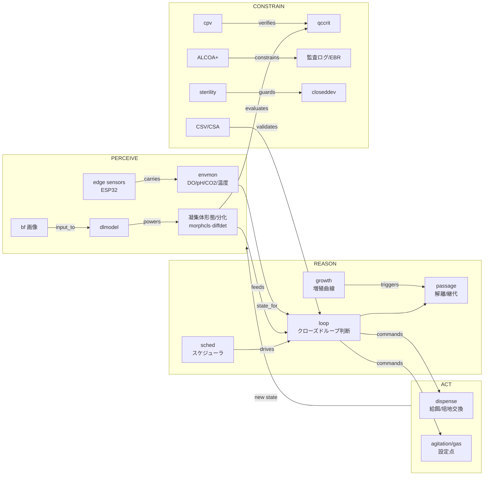

# KG → auto_cell 設計ブリッジ

`docs/knowledge_graph/` のナレッジグラフ（research SoT, 68 ノード/139 エッジ/8 ドメイン）を、
auto_cell の実装構造（`physical_ai_core.DomainVertical` ABC・ReAct ループ・Tier2 plant_model）に
落とし込むための橋渡し文書。

- **KG はそのまま設計図ではない。** KG はドメイン知識の網羅で、対象は「iPS 自動培養ソフトウェア
  全体」（樹立→維持→分化→QC、双腕も含む）。auto_cell の責務は **A 層（バイオリアクタープロセス
  制御・iPSC 浮遊/凝集体量産）** に限定（README）。本書はまず **スコープ写像**で KG を A 層に射影し、
  そのうえで各ノードを ABC slot・制御変数・規制制約へ割り付ける。
- 表記: 各設計主張の末尾 `(KG: <node_id>)` は KG ノードへの参照（`knowledge_graph.json` の `id`）。
  `〔事実〕` = KG/コードが確立済 / `〔提案〕` = 本書が KG から導いた設計 / `〔要決定〕` = 未決の判断。

---

## 1. スコープ写像 — 8 ドメイン → A 層

KG の 8 ドメインを auto_cell（A 層）の責務へ射影する。**A 層に入るのは「閉鎖系バイオリアクタ内の
浮遊/凝集体培養を連続制御する」部分のみ。** 接着 2D・双腕汎用ロボ・樹立工程は対象外だが、
WorldModel の文脈やパートナ選定では参照する。

| KG ドメイン | A 層での扱い | 主な根拠ノード |
|---|---|---|
| **d1 細胞生物学・培養プロトコル** | **中核（選択的）**: `suspension`(浮遊量産)・`maint`(維持) が直接の制御対象。`passage` は浮遊では希釈/解離継代として部分的。`qccrit` は受入基準＝イベント/バリデーションの「正解」。`reprog`(樹立)・`diff`(分化)・`signal`(添加因子) は上流/下流で **runtime 外**（文脈・将来の最適化対象）。`feeder` は浮遊の前提条件。 | suspension, maint, qccrit, passage |
| **d2 画像取得・CV** | **部分的**: 浮遊では古典的 `conf`(コンフルエンシー) は接着 2D 指標で **B 層寄り**。A 層に効くのは **凝集体サイズ/形態**（`morphcls`/`diffdet` を凝集体メトリクスへ読み替え）。画像は `route_perception` 経由で `perception.domain_data` に入れる。 | morphcls, diffdet, dlmodel, bf |
| **d3 ロボティクス・液体ハンドリング** | **部分的**: `closeddev`(閉鎖型専用機)＝制御対象のバイオリアクタ本体、`dispense`(分注)＝給餌/培地交換アクチュエータ＝ **in**。`dualarm`/`transport`/`motioncap` は接着・汎用ラボ自動化＝ **out**。 | closeddev, dispense |
| **d4 プロセス制御・自律最適化** | **中核**: `sched`+`loop` が ReAct ループそのもの＝ **in**。`bbo`/`doe`/`sdl` は CPP/設定点の **オフライン最適化メタループ**（Tier2・将来）。`rl` は研究段階（GMP の検証性が壁, KG 記載）＝ out。 | sched, loop, bbo, doe |
| **d5 ソフト基盤・相互運用** | **基盤（infra/Tier1）**: `sila`/`opcua`/`gateway` がデバイス IF、`orch` がスケジュール宿主、`lims`/`datamodel` がデータ層。auto_cell は core の `device_registry`／`infra/virtual_edge` の背後にこれを置く。 | sila, opcua, gateway, datamodel |
| **d6 GMP・規制・データインテグリティ** | **横断制約**: 設計境界を規定。`validate_tool_call`・sanitizer・監査ログ・EBR の **技術的統制**として実装に織り込む（フル準拠はプログラム全体の責務）。 | alcoa, part11, audit, csv, gctp |
| **d7 センサ・環境モニタリング** | **中核**: `envmon`(DO/pH/CO₂/温度) が `channel_config` の主役、`sterility` がイベント、`cpv` が at-line QC、`edge`(ESP32) が Tier1 結線。 | envmon, sterility, cpv, edge |
| **d8 エコシステム・プレイヤー** | **参照（runtime 外）**: 技術選定・build/buy・IF ターゲットの地図。`closeddev` 系（CiRA/Terumo/Panasonic）を HW 抽象のターゲットに、双腕系（Maholo/Astellas）は対象外と確認。 | cira, terumo, pana, kaneka |

---

## 2. 制御ループ写像 — KG クロスエッジ = ReAct ループ

KG の `contains`/`has` 以外の **typed edge（動詞）はそのまま制御依存方向**。これを A 層の
ReAct ループ（30 秒周期 or MQTT イベント、最大 5 反復/周期、3 秒バッチ遅延、
perceive→reason→act→speak; sanitizer がレート制限）に重ねると、KG が制御アーキテクチャを
ほぼそのまま記述していることがわかる。

ループ各相と core の対応:

| 相 | 役割 | core / ABC 上の置き場 | KG ノード |
|---|---|---|---|
| **perceive** | センサ＋画像を WorldModel へ | `route_channel` → `domain_envs["cell_culture"]`、`route_perception` → `perception.domain_data` | envmon, edge, dlmodel, morphcls, diffdet |
| **reason** | 状態→判断（給餌/交換/撹拌/継代/サンプル/通知） | LLM + `system_prompt_section` + `build_culture_unit_summary` + `detect_events` | loop, sched, growth, conf |
| **act** | アクチュエータ呼び出し | `tool_schemas` / `tool_handlers` | dispense, closeddev, passage |
| **speak** | アラート/通知（レート制限） | sanitizer + `suppression_defaults` | loop, capa |
| **constrain** | 安全包絡線＋規制 | `validate_tool_call` + sanitizer + 監査ログ | alcoa, part11, csv, audit, sterility |

**設計上重要なエッジ**:
- `growth --triggers--> passage` 〔事実: KG〕: 増殖曲線予測が継代の起点。→ `detect_events` で `vcd_target_reached` を出し、`loop` が `trigger_passage` を判断する閉ループの中心。
- `csv --validates--> loop` 〔事実: KG〕: **制御ループ自体が CSV/CSA 検証対象**。→ ループは決定的・テスト可能であるべき。Tier2 `plant_model` がその検証リグ（§6）。
- `alcoa --constrains--> {audit, ebr, datamodel}` 〔事実: KG〕: 全データ取り込み・全操作ログが ALCOA+ に従う。→ `tool_handlers` の副作用は監査可能ログ必須（§5）。

---

## 3. DomainVertical プラグイン設計面（KG concept → ABC slot）

`CellCulturePlugin(DomainVertical)` の各 slot に KG ノードを割り付けた **提案**。slot 名は
`physical-ai-core/.../plugin_base.py` の実シグネチャ。

| ABC slot | 提案内容 | 由来 KG |
|---|---|---|
| `domain_id` / `display_name` | `"cell_culture"` / `"細胞培養（iPSC 浮遊）"` 〔提案〕 | root |
| `culture_unit_field_name()` | `"cell_culture"`（`domain_envs` / `perception.domain_data` のキー）〔提案〕 | — |
| `applicable_zone_types()` | `{"suspension_bioreactor"}`〔要決定: 命名 §7〕 | suspension, closeddev |
| `environment_model()` | `CellCultureEnv`(BaseModel): VCD, viability, glucose, lactate, glutamine, ammonia, pH, DO, CO₂, temp, osmolality, agitation_rpm, aggregate_diameter_um, culture_age_d, phase。CPP は §4。 | maint, suspension, envmon, signal |
| `channel_config()` | 連続計測チャネル（§4 の channel 列）。`do`/`ph`/`lactate` は半減期・トレンド閾値を個別調整。 | envmon, edge, cpv |
| `route_channel()` | チャネル→`CellCultureEnv` フィールドへ書込。対象外は False。 | edge, envmon |
| `route_perception()` | 凝集体サイズ/形態/分化領域比を `perception.domain_data["cell_culture"]` へ。古典 confluency は不採用（接着指標）。 | morphcls, diffdet, dlmodel |
| `detect_events()` | §4 のイベント列（do_low, lactate_high, glucose_low, aggregate_out_of_range, vcd_target_reached, contamination_suspected, osmolality_high）。 | sterility, qccrit, growth, cpv |
| `event_descriptions()` / `suppression_defaults()` | 各イベントの日本語説明＋抑制窓（例: do_low=300s, contamination_suspected=0 即時）。 | capa, sterility |
| `tool_schemas()` / `tool_handlers()` | 副作用ツール: `set_agitation_rpm`, `feed`, `exchange_media`, `set_gas_setpoint(DO)`, `trigger_passage`(method, rock_inhibitor=Y-27632), `take_sample`, `adjust_setpoint`。 | dispense, closeddev, passage, signal |
| `query_tool_names()` | 読み取り専用（レート制限バイパス）: `get_culture_unit_status`, `get_recent_trend`, `get_cpp_envelope`。 | loop |
| `validate_tool_call()` | CPP 包絡線（min/max）＋ **変化率制限**（シア/浸透圧ショック回避, `passage` のシアストレス管理）＋検証済設定点外への変更禁止。 | passage, csv, qccrit |
| `system_prompt_section()` | iPSC 浮遊培養の制御方針・CPP 目標・継代基準・無菌優先を LLM に注入。 | suspension, maint, qccrit |
| `build_culture_unit_summary()` | 現在の CPP 値・トレンド・凝集体サイズ・培養日数・直近イベントを要約。 | loop, envmon |
| `exposed_env_properties()` | `{"lactate_status", "do_status", "aggregate_status", "passage_readiness"}` 等の計算済プロパティ。 | qccrit, growth |
| `on_init()` / `background_tasks()` | 起動時 CPP 包絡線ロード／定期 at-line サンプリングのスケジュール。 | sched, cpv |

> **参照実装**: プラグイン docstring 記載どおり auto_JA hydroponics（液系 pH/DO/温度/流量）が
> 最も近い類型。継代・凝集体・無菌・規制の 4 点が細胞培養固有の追加。

---

## 4. CPP / 制御変数カタログ

A 層の Critical Process Parameter。設定値はプラグイン docstring と Tier2 `plant_model` の
Monod 定数に整合。**まずは固定の検証済設定点で出荷し（CSV）、BBO による最適化は後段**〔提案〕。

| 変数 | 目標/範囲 | channel | アクチュエータ(tool) | イベント | KG | plant 定数 |
|---|---|---|---|---|---|---|
| pH | 7.1 | `ph` | CO₂/塩基添加 `set_gas_setpoint` | `ph_out_of_range` | envmon | — |
| DO | 40 %（→10% は失敗軌道） | `do` | スパージ/撹拌 `set_gas_setpoint`,`set_agitation_rpm` | `do_low` | envmon | DO 40→10% |
| 撹拌 | 50–120 rpm | `agitation` | `set_agitation_rpm` | `shear_risk` | passage(シア管理) | — |
| 乳酸 | < 50 mM | `lactate`(at-line) | 培地交換/灌流 `exchange_media` | `lactate_high` | suspension, cpv | KLac=50 mM |
| グルコース | > 1.5 mM | `glucose` | 給餌 `feed` | `glucose_low` | maint | KGlc=1.5 mM |
| グルタミン | > 0.01 mM | `glutamine` | `feed` | `glutamine_low` | maint | KGln=0.01 mM |
| 浸透圧 | < 500 mOsm | `osmolality` | `exchange_media` | `osmolality_high` | suspension | KOsm=500 mOsm |
| 凝集体径 | 150–350 µm | `aggregate_diameter_um`(画像) | 撹拌/解離 `trigger_passage` | `aggregate_out_of_range` | suspension | KAgg=175 µm |
| VCD | 目標到達で継代 (~35×10⁶/mL) | `vcd`(キャパシタンス) | `trigger_passage` | `vcd_target_reached` | growth→passage | µ=1.35 /d, 7d~35e6 |
| 温度 | 37 ℃ | `temp` | ヒータ | `temp_out_of_range` | envmon | — |
| 無菌性 | 逸脱ゼロ | `sterility`(event) | （停止/隔離 → CAPA） | `contamination_suspected` | sterility→capa | — |

`trigger_passage` は浮遊では希釈/解離継代。解離時 ROCK 阻害剤 Y-27632 添加・シアストレス管理が
品質を左右する (KG: passage) → `validate_tool_call` が解離強度の上限と Y-27632 同時添加を強制〔提案〕。

---

## 5. 規制・データインテグリティ → 技術的統制（d6）

KG d6 は「設計の制約条件」(KG: d6 content)。フル GMP 準拠はプログラム全体の責務だが、
**ソフトに織り込むべき技術的統制**は以下。auto_cell の実装要件として確定的に扱う。

| KG 制約 | 設計要件（auto_cell） | 置き場 |
|---|---|---|
| `audit` 監査証跡 + `part11` | 全副作用ツール呼び出しを「誰/いつ/何を/なぜ」で不変ログ化。`tool_executor` 実行ログ + `event_store`。 | core tool_executor / EventWriter |
| `alcoa` ALCOA+ → `datamodel` | 全センサ/画像/操作データを attributable・contemporaneous な timestamp 付きで取り込む。 | WorldModel ingest / event_store |
| `ebr` 電子バッチ記録 | 1 培養ラン = 1 EBR を event ログから導出可能に（前工程検証→次工程整合）。 | event_store からの導出ビュー |
| `csv` CSV/CSA → `loop` | **制御ループが検証可能**であること: 決定的 sanitizer ルール＋ Tier2 plant での回帰検証（§6）。 | sanitizer + sim/plant_model |
| `capa` → `sterility` | 逸脱（汚染等）検知 → CAPA フックへ。`contamination_suspected` は抑制窓 0（即時）。 | detect_events / suppression_defaults |
| `gctp`/`ramlaw` | 設計境界の規定（`gctp --defines--> qccrit`）。受入基準＝イベント閾値の根拠。 | 参照（境界定義） |

---

## 6. Tier2 plant_model との整合（CSV 検証リグ）

`sim/plant_model` の Monod 型 ODE（KGlc/KLac/KGln/KOsm/KAgg, µ=1.35/d）は KG の浮遊速度論
(KG: suspension, `kaneka --demonstrates--> suspension`, `src_susp --reports--> suspension`) を
scipy 再実装したもの。`step(actuators) -> sensors` IF で ReAct ループを **文献接地プラントに対して
閉じる**。

これは §5 の `csv --validates--> loop` 要件を開発時に満たす **検証リグ**でもある:
- 検証目標: 公開軌道（7 日 ~35×10⁶ cells/mL、乳酸蓄積、DO 40→10%）の再現。
- ループ回帰テスト: 同一アクチュエータ系列 → 同一センサ軌道（決定性）を CI で固定。
- 将来 COBRApy+GEM / 商用 co-sim にバックエンド差替可能な IF を維持（README）。

§4 の plant 定数列が CPP イベント閾値と同じ値を共有している点が肝: **プラントとプラグインが
同じ生物学的定数を参照**するので、Tier2 で校正したイベント閾値がそのまま runtime に効く。

---

## 7. エコシステム → 技術選定（d8 + d5）

| 判断軸 | KG が示す選択肢 | 提案 |
|---|---|---|
| HW 抽象ターゲット | `closeddev`(閉鎖型専用機: CiRA my iPS, Terumo Quantum Flex, Panasonic) vs `dualarm`(Maholo/Astellas) | **closeddev 系**に限定。双腕は B 層で対象外 (KG: `terumo --provides--> closeddev`, `cira --uses--> closeddev`)。 |
| デバイス IF | `sila`(SiLA2: HTTP/2+protobuf) / `opcua`(OPC-UA/LADS) / `gateway`(レガシー橋渡し) | 〔要決定〕Tier1 は `infra/virtual_edge`(MQTT) で結線検証 → 実機は SiLA2 アダプタを `device_registry` 背後に。`gateway --bridges_to--> sila` の階層を踏襲。 |
| 最適化エンジン | `bbo`(GPyOpt, Epistra) / `sdl` / `rl`(研究) | CPP/設定点最適化は **オフライン meta-loop**（Tier2 上）。runtime ループには入れない。RL は除外（KG: GMP 検証性が壁）。 |

---

## 8. 未解決の設計判断（要決定）

1. **MQTT プレフィクス**: auto_cell は新リネージ。auto_JA は `farm/{zone}/...`、SOMS は `office/`。
   提案: `cell/{culture_unit}/{sensor|actuator}/{device_id}/{channel}` 〔要決定〕。
2. **デバイス IF ターゲット**: SiLA2 / OPC-UA / 直 MQTT のどれを実機 Tier1 の第一級にするか（§7）。
3. **浮遊での画像知覚スコープ**: in-line イメージング vs サンプリング顕微。`route_perception` を
   Phase 1 で実装するか後回しか（凝集体径だけ先行する案）。
4. **zone_type 命名**: `suspension_bioreactor` / `stirred_tank` / `vertical_wheel`。
5. **CPP 最適化の位置**: 固定検証済設定点先行（CSV 容易）→ BBO 後段、で確定してよいか。
6. **継代の定義**: 浮遊での「継代」を希釈/解離/分割のどれで一次実装するか（`trigger_passage` の意味論）。

---

## 9. トレーサビリティ（設計要素 → KG ノード）

| 設計要素 | KG ノード |
|---|---|
| 制御ループ（perceive→reason→act） | loop, sched, growth, conf, envmon |
| CPP / environment_model | maint, suspension, signal, envmon, qccrit |
| センサ channel | envmon, edge, cpv |
| 画像 route_perception | morphcls, diffdet, dlmodel, bf |
| アクチュエータ tool | dispense, closeddev, passage |
| イベント / 安全 | sterility, capa, qccrit, growth |
| 規制制約 / 監査 | alcoa, part11, audit, csv, ebr, gctp, ramlaw |
| Tier2 plant | suspension, kaneka, src_susp |
| 技術選定 | cira, terumo, pana, kaneka, sila, opcua, gateway, bbo, epistra |

---

> 一次資料: [`../knowledge_graph/`](../knowledge_graph/)（ビューア = `ips_automation_knowledge_map.html`）。
> ABC 実体: `physical-ai-core/src/physical_ai_core/brain/plugin_base.py`。
> CPP/plant 定数: `src/auto_cell/plugins/cell_culture/__init__.py`, `sim/plant_model/__init__.py`。
